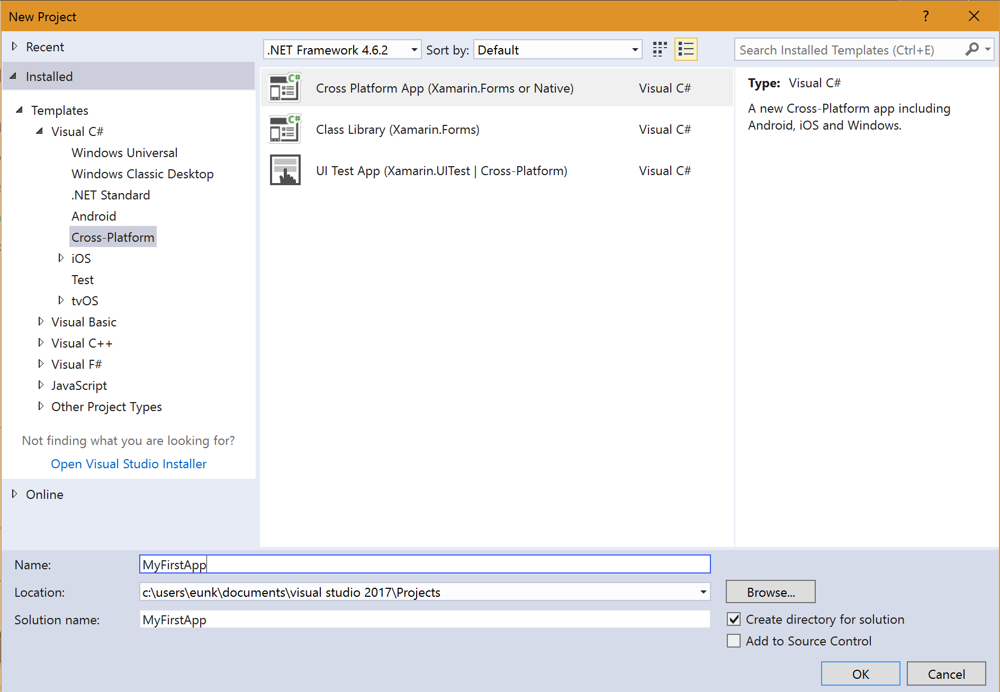
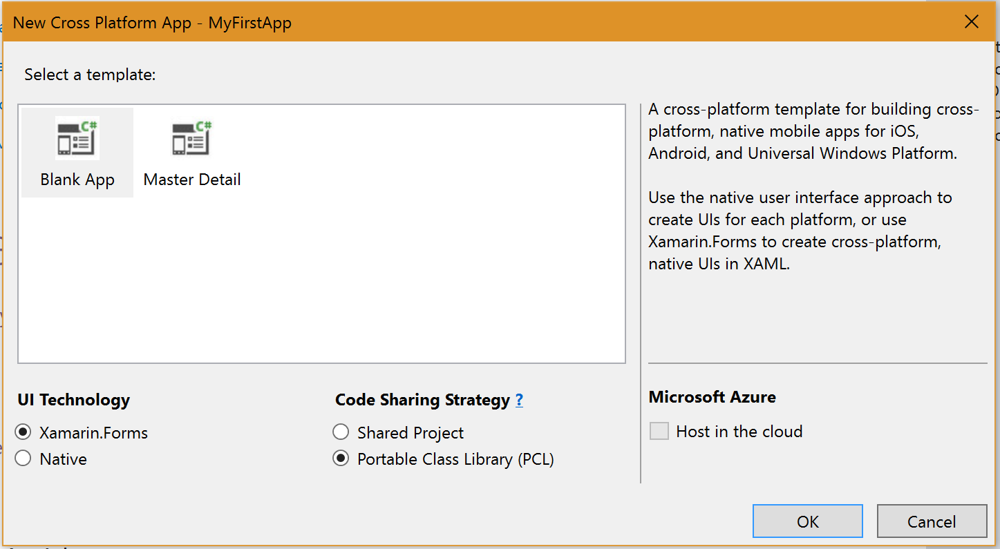
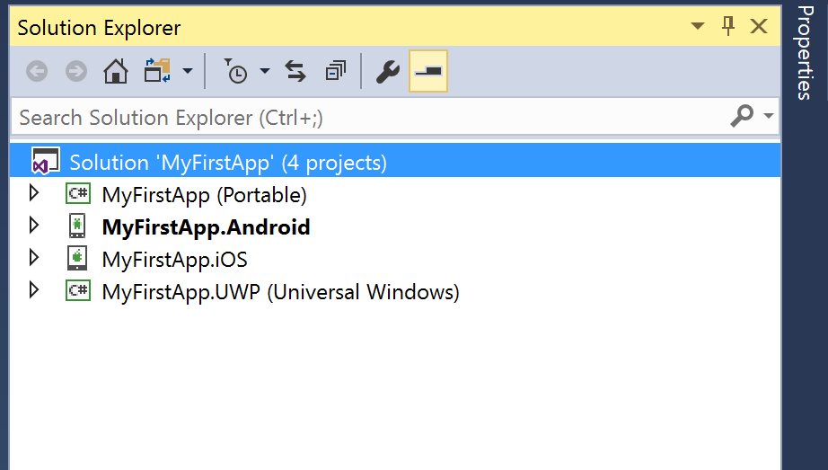

# 101 Setup
## Lab 1
### 시작하기 전에
이것은 Mac의 Visual Studio 또는 Windows의 Visual Studio를 사용할 수있는 크로스 플랫폼 클래스입니다. 코딩 연습을 완료하려면 Xamarin 개발 환경이 필요합니다. 에뮬레이터 / 시뮬레이터 또는 장치를 사용하여 iOS, Android 또는 Windows Phone 용 연습 문제를 실행할 수 있습니다. 또는 Windows 8 또는 Windows 10에 로컬로 배포 할 수 있습니다. Xamarin 개발 환경을 설치하는 데 도움이 필요하면 설치 요구 사항을 읽어보십시오.

### 개요
이 수업은 iOS, Android 및 Windows 용 Xamarin 및 모바일 개발에 대한 간략한 소개입니다. Xamarin 도구를 사용하여 모바일 응용 프로그램 개발 수명주기를 다루며 Xamarin University 교육의 시작점입니다.

### 목표
1. Xamarin SDLC
2. Installing Xamarin

### 실습 
1. Xamarin 실습
이 연습에서는 iOS와 Android를 모두 대상으로하는 기존 애플리케이션을 빌드하고 실행합니다. 이를 통해 수업 중 개발 환경을 테스트하고 필요한 경우 강사의 도움을 얻을 수 있습니다.

### 예상 소요시간
15분

### 목표
이 연습에서는 포함 된 Tasky Pro 응용 프로그램을 빌드하고 실행합니다. 가능한 경우 iOS와 Android 버전을 모두 빌드해야합니다. 이렇게하면 개발 환경을 올바르게 설정하고 Xamarin University 교육을받을 수 있습니다. 이미 Xamarin 응용 프로그램을 성공적으로 빌드 / 컴파일 한 경우이 연습을 건너 뛸 수 있습니다.

## 실습 과정
### Visual Studio 실행
1. Visual Studio 2017을 실행합니다. 
2. **File > New > Project**룰 클릭하여 새로운 프로젝트 만들기를 시작해봅니다.

### Xamarin.Forms 솔루션 생성 
1. 좌측의 메뉴에서 **Templates > Visual C# > Cross-Platform** 을 선택합니다.
2. **Cross Platform App** 을 선택하고, 이름을 **MyFirstApp** 이라고 변경합니다.

3. **Blank App**을 선택하고, UI Technology는 **Xamari.Forms** 를 선택, Code Sharing Strategy는 **Portable Class Library(PCL)**을 선택합니다.
4. **OK** 버튼을 눌러서 계속 진행합니다.

5. Winows application 버전과 관련하여 안내 메세지가 뜨는 경우, **OK** 버튼을 눌러서 계속 진행하시기 바랍니다.

### 생성된 프로젝트 목록 확인
1. Solution Explorer 에서 생성된 프로젝트 목록을 확인하시기 바랍니다. 
MyFirstApp이라는 솔루션 아래에 **MyFirstApp(Portable)** 이라는 공통의 라이브러리들을 위한 PCL 프로젝트와, Android용 프로젝트인 **MyFirstApp.Android**, iOS용 프로젝트인 **MyFirstApp.iOS**, 윈도우 10에서 동작하는 애플리케이션용 프로젝트인 **MyFirstApp.UWP**가 각각 생성된 것을 확인하실 수 있습니다. 

2. **MyFirstApp.UWP**에서 마우스 오른쪽 버튼을 클릭하고 **Set as StartUp Project**를 선택하시기 바랍니다. 

3. **MyFirstApp.UWP** 프로젝트에서 마우스 오른쪽 버튼을 클릭하고 **Deploy** 버튼을 눌러서 배포를 진행하시기 바랍니다. 

4. 배포가 성공적으로 완료되면 아래와 같이 **MyFirstApp.UWP**로 설정을 변경하신 후, **Local Machine**을 선택하고 녹색 버튼을 눌러서 프로그램을 실행해보시기 바랍니다.

5. Welcome to Xamarin Forms! 메세지를 확인하실 수 있습니다. 

