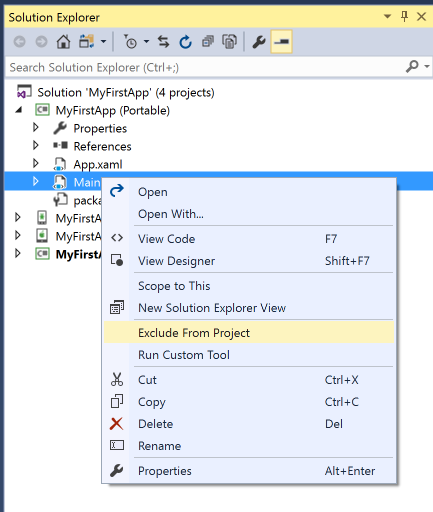
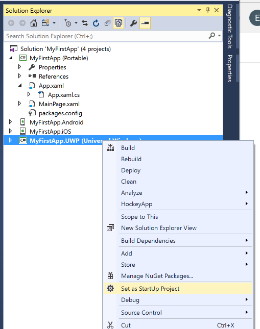

## 120 - Lab1 여러 플랫폼을 이용하여 프로젝트 실행해보기 
### 예상 소요시간
15분

### 목표
Visual Studio에서 제공되는 프로젝트 템플릿을 사용하여 Xamarin.Forms 응용 프로그램을 만들어 볼 예정입니다. 그 다음으로는 플랫폼 특정 프로젝트간에 코드를 공유하는 방법을 알아볼 것입니다. 

## 실습과정
### 프로젝트 열기
MyFirstApp 프로젝트를 여시고 실행하시기 바랍니다. 완성을 못하신 분들은 여기에서 다운로드 받으시기 바랍니다.

### 솔루션 구조 이해하기
1. 솔루션에 생성되는 여러가지 프로젝트들
* FirstApp - Xamarin.Forms 코드가 있는 PCL입니다. 대부분의 UI와 로직이 여기에 추가됩니다. 이 프로젝트는 운영체제나 개발 환경에 관계없이 항상 생성됩니다.
* FirstApp.iOS - iOS 애플리케이션을 생성 할 iOS 플랫폼 전용 프로젝트입니다. 
* FirstApp.Droid - Android에 배포 할 .apk를 생성하는 Android 관련 프로젝트입니다. 
* FirstApp.UWP - Windows 10 기기에서 동작하는 UWP 관련 프로젝트입니다.

2. 공유 코드 라이브러리를 열어보시면 **App.xaml** 파일과 **MainPage.xaml** 파일이 있습니다. 클릭하여 확인해보세요.

3. 해당 플랫폼별 코드에는 공통점이 있습니다. 
* 최소한 2개의 플랫폼에 대한 어셈블리 참조를 가지고 있는데 **Xamarin.Forms.Core** 와 **Xamarin.Forms.Platform.XXX** 입니다. 
* 모든 프로젝트에는 초기화 코드가 있는데 Xamarin을 호출하는 코드인 **Forms.Init** 입니다. 이것은 모든 플랫폼 어셈블리에 정의 된 플랫폼 별 메소드입니다 (플랫폼마다 조금씩 다르게 구현 되더라도 항상 동일한 이름을 가집니다). 각각이 약간 다른 매개 변수를 취하는데  예를 들어 Xamarin.Forms가 리소스를 찾을 수 있도록 Android 패키지가 응용 프로그램 번들에 전달됩니다. 그런 다음 공유 코드에 정의 된 Application 파생 클래스의 새 인스턴스가 전달 된 LoadApplication이 호출됩니다. 이것이 기술에 고유 한 초기 화면을 만드는 것입니다.

### Single Page로 변경하기
1. **MainPage.xaml** 파일을 프로젝트에서 제외합니다. 


2. **App.xaml.cs** 파일에 아래의 내용을 업데이트 합니다.
```
public App()
{
    // The root page of your application
    var layout = new StackLayout
    {
        VerticalOptions = LayoutOptions.Center,
        Children = {
            new Label {
                HorizontalTextAlignment = TextAlignment.Center,
                Text = "Welcome to Xamarin Forms!"
            }
        }
    };

    MainPage = new ContentPage {
        Content = layout
    };

    Button button = new Button {
        Text = "Click Me"
    };

    button.Clicked += async (s, e) => {
            await MainPage.DisplayAlert("Alert", "You clicked me", "OK");
        };

    layout.Children.Add(button);            
}    
```

3. 원하는 플랫폼을 시작 프로젝트로 설정하고 실행하세요. 


4. UI 버튼을 누르면 알림 메세지를 확인하실 수 있습니다. 
