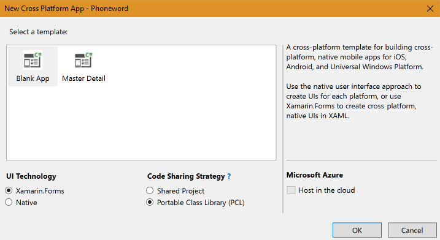

## 120 - Lab2 전화걸기 기능의 UI 만들기 
### 예상 소요시간
20분

### 목표
목표는 전화 번호를 입력받아서, 전화를 걸기위한 UI를 표시하는 프로그램을 만드는 것입니다. UI는 Label, Entry 및 두 개의 Button으로 구성됩니다.


UI를 만드는 과정은 다음과 같습니다. 
* UI 생성 - StackLayout, Label, Entry 및 두 개의 Button 요소를 사용하여 UI를 만듭니다.
* 이벤트 추가
1. **Translate Button**에 Click 이벤트를 추가하세요.
2. **Entry** 항목에 숫자 입력을 받을 것 입니다. 
3. 영숫자 텍스트를 ABC ➡ 2, DEF ➡ 3 등의 기존 전화 번호로 번역하겠습니다.
4. 번역 된 숫자로 된 전화 번호를 포함하도록 통화 버튼의 텍스트를 업데이트하십시오. 사용자가 버튼을 탭할 수 있도록 활성화 상태를 업데이트 할 예정이지만 다음 연습까지는 아무런 동작도 추가하지 않습니다.

## 실습자료
Part 02 Resources 폴더에는 프로젝트에 추가 할 PhoneTranslator.cs라는 C # 소스 파일이 들어 있습니다.

## 실습과정
### 프로젝트 생성
1. **File > New > Project** 에서 새로운 프로젝트를 만드세요.
2. 프로젝트 템플릿에서 **Cross-Platform** 을 선택하신 후 **Cross Platform App(Xamarin.Forms or Native)**를 선택하신 다음 이름에 **Phoneword**를 입력하세요


3. **Blank App** 템플릿에, UI Technology는 **Xamarin.Forms**를 Code Sharing Strategy는 **Portable Class Libarary(PCL)**을 선택하시고 **OK** 버튼을 눌러서 프로젝트를 생성하시기 바랍니다. 


### PhoneTranslator.cs 파일 추가
1. **Phoneworld(Portable)** 프로젝트에서 마우스 오른쪽 버튼을 클릭하고 **Add > 

### 기본으로 작성된 Template 코드 변경
1. **App.xaml.cs** 파일의 **App()** 부분을 아래와 같이 바꾸시기 바랍니다. 
```
public App()
{
    // The root page of your application
    MainPage = new NavigationPage(new MainPage());
}
```

//NavigationPage의 역할이 뭔지 설명하는 부분 집어넣기

2. UI 만들기
첫번째는 어떤 것을 입력해야 하는지 안내하는 Label에 **Phoeword 입력:** 하고, 그 다음애는 사용자 입력을 받는데 사용할 컨트롤인 **Entry**와 입력 받은 내용을 적절한 형식으로 변환해주는 **Translate** 버튼을 만듭니다. 전화걸기 기능을 위한 **Call** 버튼도 추가합니다. 
아래의 코드는 위의 요구사항을 C#으로 구현한 것 입니다.
MainPage.xaml.cs 에 아래의 코드를 입력하세요.

```
public class MainPage : ContentPage
{
   Entry phoneNumberText;
   Button translateButton;
   Button callButton;

   public MainPage()
   {
        this.Padding = new Thickness(20, 20, 20, 20);

        StackLayout panel = new StackLayout
        {
            Spacing = 15
        };

        panel.Children.Add(new Label {
            Text = "Enter a Phoneword:",
            FontSize = Device.GetNamedSize(NamedSize.Large, typeof(Label))
        });

        panel.Children.Add(phoneNumberText = new Entry {
            Text = "1-855-XAMARIN",
        });

        panel.Children.Add(translateButton = new Button {
            Text = "Translate"
        });

        panel.Children.Add(callButton = new Button {
            Text = "Call",
            IsEnabled = false,
        });

        this.Content = panel;
    }
}
```

### Translate Button의 이벤트 구현하기
Translate 버튼을 눌렀을때 발생하는 이벤트를 구현하는 코드를 추가하겠습니다.

1. MainPage Class 내부에 변경된 전화번호를 담을 string 변수를 선언하세요
2. MainPage의 생성자에 translateButton이 눌렸을때 OnTranslate 이번테를 발생시키도록 이벤트 핸들러에 등록하세요.
3. OnTraslate 메소드에 버튼을 눌렀을때 숫자가 아닌 알파벳은 숫자로 변환해주는 메소드를 작성하세요.
완성된 코드는 아래와 같습니다. 

```
public class MainPage : ContentPage
{
    ...
    string translatedNumber;

    public MainPage()
    {
        ...
        translateButton.Clicked += OnTranslate;

        this.Content = panel;
    }
    void OnTranslate(object sender, System.EventArgs e)
    {
        translatedNumber = Core.PhonewordTranslator.ToNumber(phoneNumberText.Text);
        if (!string.IsNullOrEmpty(translatedNumber)) {
            callButton.IsEnabled = true;
            callButton.Text = "Call " + translatedNumber;
        } else {
            callButton.IsEnabled = false;
            callButton.Text = "Call";
        }
    }
}
```
