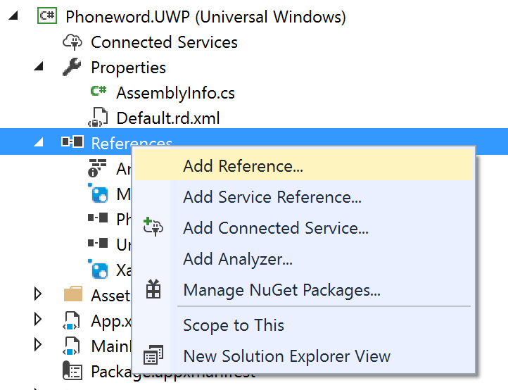

## 120 - Lab3 이벤트 및 Platform Specific API 사용하기 
### 예상 소요시간
15분

## 목표
버튼이 눌렀을 떄 동작하도록 하는 이벤트를 추가하고, Platform Specific API를 활용하여 전화걸기 기능을 구현합니다. 

## 실습자료
아래와 같은 실습에 필요한 파일들을 제공합니다.
* ForPlatform.cs
* PhoneDialer.iOS.cs
* PhoneDialer.Droid.cs
* PhoneDialer.UWP.cs

## 실습과정
### Button에 이벤트 추가하기
1. **MainPage.xaml**로 이동하신 후 **전화걸기 버튼**에 아래의 코드처럼 Clicked 이벤트를 추가하시기 바랍니다. 
```
<Button Text="전화걸기" Clicked="OnCall"/>
```

2. **MainPage.xaml.cs**로 이동하신 후 MainPage() 메소드 아래에 다음의 코드를 추가하시기 바랍니다. 버튼을 눌렀을 때 알림창이 뜨고, 확인버튼을 누르면 전화걸기를 실행하는 코드입니다. 
```
async void OnCall(object sender, System.EventArgs e)
{
    if (await this.DisplayAlert(
        "Dial a Number",
        "Would you like to call " + phoneNumberText.Text + "?",
        "Yes",
        "No"))
    {
        var dialer = DependencyService.Get<IDialer>();
        if (dialer != null)
        {
            await dialer.DialAsync(phoneNumberText.Text);
        }
    }
}
```

### IDialer 인터페이스 구현
전화걸기 기능은 플랫폼 별로 코드를 구현해 주어야 하는 기능입니다. 이를 위해서 PCL 프로젝트에서 추상화 클래스를 만든후, 이를 각 플랫폼별 코드에서 구현하겠습니다. 

1. **MainPage.xaml.cs**에서 OnCall() 메소드 아래 부분에 **IDialer** 라는 인터페이스를 구현합니다. string을 매개변수로 받아 bool을 리턴하는 메소드를 선언합니다. 
구현한 코드는 아래와 같습니다. 
```
public interface IDialer
{
    Task<bool> DialAsync(string number);
}
```

2. 각각의 플랫폼별로 미리 작성해둔 resouces아래에 있는 파일들을 추가합니다. 예를들어 Android의 경우는, **Phoneword.Android** 프로젝트에 **PhoneDialer.Droid.cs** 클래스를 추가합니다. 


### 권한설정 및 Extention 추가
[Android]
Andorid의 경우 전화걸기 권한을 활성화 해 주어야 합니다.
1. **Properties**를 여시기 바랍니다.
2. **Android Manifest**를 클릭하시기 바랍니다. 
3. **Required permission** 에서 **CALL_PHONE** 체크박스에 체크를 하시기 바랍니다.  


[UWP]
UWP의 경우 별도의 Extention 설치와 권한추가가 필요합니다.

1. **Properties** 파일을 여시기 바랍니다.


2. **Package Manifest**를 클릭하시기 바랍니다.


3. **Capabilities** 탭을 클릭하시고, **Phone Call** 항목에 체크박스를 선택하시기 바랍니다.


4. Phoneword.UWP 프로젝트에서 **References > Add Reference...** 를 클릭하시기 바랍니다. 


5. **Univeral Windows > Extentions** 탭에서 **Windows Mobile Extentions for the UWP** 항목을 추가하시기 바랍니다. 


### 실행결과
변경사항을 저장하고 실행하면 다음과 같은 화면을 보실 수 있습니다. 
