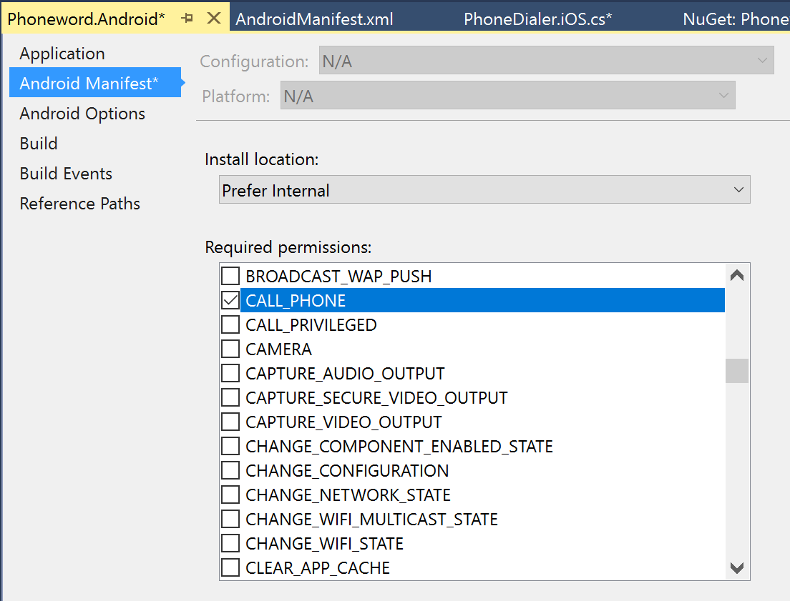
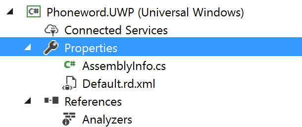
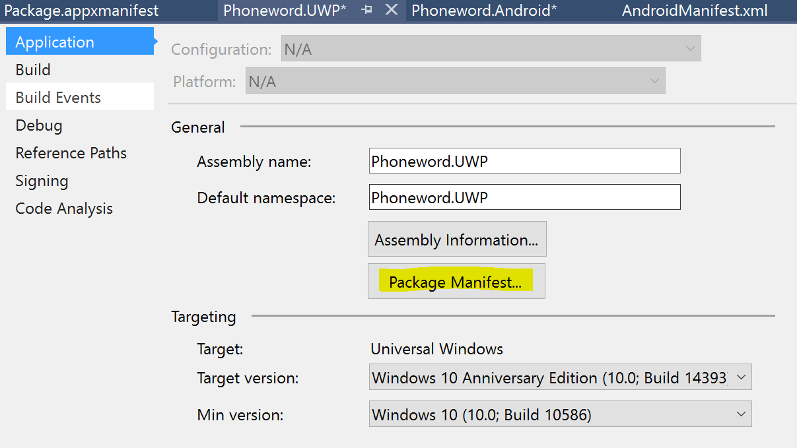
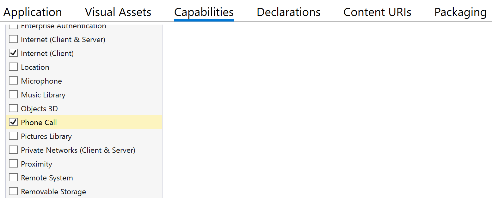
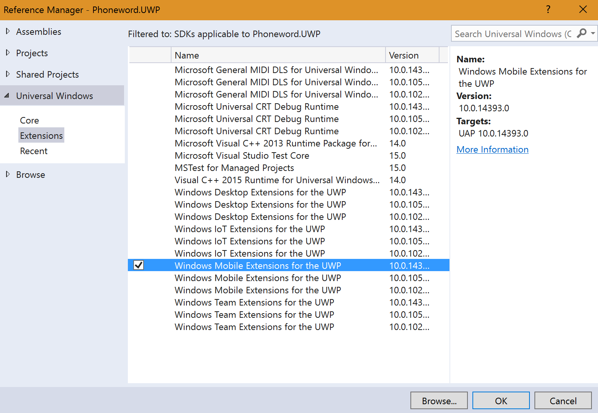

## 120 - Lab3
### 예상 소요시간
15분

## 목표
플랫폼 별 UI를 추가하고 Phoneword 애플리케이션에 동작을 추가하여 경고를 표시하고 사용자가 전화를 걸도록하는 것입니다.

## 실습자료
아래와 같은 실습에 필요한 파일들을 제공합니다.
* ForPlatform.cs
* PhoneDialer.iOS.cs
* PhoneDialer.Droid.cs
* PhoneDialer.UWP.cs

## 실습과정
### 플랫폼 별 UI 변경하기
iOS의 경우 상태표시줄이 UI가 예쁘지 않은것을 볼 수 가 있습니다. 이를 변경하기 위해서는 아래의 과정이 필요합니다. 

1. **OnPlatform** 이라는 메소드를 사용하여 iOS 경우만 별도로 UI를 변경할 수 있습니다.
```
// The generic specification <T> can typically be inferred,
// it is shown here for clarity.
double paddingThickness = new Thickness(
    20,
    Device.OnPlatform<double>(40, 20, 20),
    20,
    20
);
```
2. iOS에서 애플리케이션을 동작시켜 변화된 모습을 확인하실 수 있습니다.
//이미지 삽입

### 전화걸기 기능을 구현하기 위해 플랫폼별 코드 구현
전화걸기 기능은 플랫폼 별로 코드를 구현해 주어야 하는 기능입니다. 이를 위해서 PCL 프로젝트에서 추상화 클래스를 만든후, 이를 각 플랫폼별 코드에서 구현하는 방식으로 진행하겠습니다. 

1. **IDialer** 라는 인터페이스를 구현합니다. string을 매개변수로 받아 bool을 리턴하는 메소드를 선언합니다. 
구현한 코드는 아래와 같습니다. 
```
// IDialer.cs
public interface IDialer
{
    Task<bool> DialAsync(string number);
}
```

2. 인터페이스는 PCL 프로젝트 내에 위치해야 합니다. 
3. 각각의 플랫폼별로 미리 선언해둔 아래의 파일들을 추가합니다.


### 권한설정 및 Extention 추가
[Android]
Andorid의 경우 전화걸기 권한을 활성화 해 주어야 합니다.
1. **Properties**를 여시기 바랍니다.
2. **Android Manifest**를 클릭하시기 바랍니다. 
3. **Required permission** 에서 **CALL_PHONE** 체크박스에 체크를 하시기 바랍니다.  


[UWP]
UWP의 경우 별도의 Extention 설치와 권한추가가 필요합니다.

1. **Properties** 파일을 여시기 바랍니다.


2. **Package Manifest**를 클릭하시기 바랍니다.


3. **Capabilities** 탭을 클릭하시고, **Phone Call** 항목에 체크박스를 선택하시기 바랍니다.


4. Phoneword.UWP 프로젝트에서 **References > Add Reference...** 를 클릭하시기 바랍니다. 


5. **Univeral Windows > Extentions** 탭에서 **Windows Mobile Extentions for the UWP** 항목을 추가하시기 바랍니다. 


### Call 버튼 눌러보기
1. 생성자 내부에 Call 버튼이 눌렸을 떄 호출되는 이벤트인 **OnCall**을 추가한다.
```
callButton.Clicked += OnCall;
```
2. OnCall을 자동생성 메서드를 이용하여 생성한다. 
3. 아래의 코드를 입력하여 전화를 걸었을때의 동작을 정의한다. 
```
async void OnCall(object sender, System.EventArgs e)
{
    if (await this.DisplayAlert(
        "Dial a Number",
        "Would you like to call " + translatedNumber + "?",
        "Yes",
        "No")) {

        var dialer = DependencyService.Get<IDialer>();
        if (dialer != null) {
            await dialer.DialAsync(translatedNumber);
        }

    }

}
```
