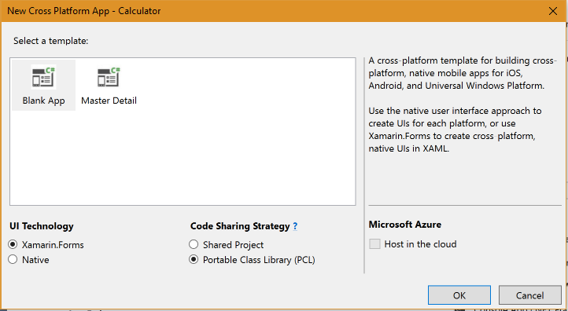

## 130 - Lab1
### 예상 소요시간
30분

### 목표
이 연습에서는 기존 Xamarin.Forms 를 이용하여 계산기를 만들어 보면서 XAML로 Layout을 작성하는 방법과 이벤트 처리를 사용해보겠습니다. 

### 실습자료 
이 연습에는 Resources 폴더의 시작 프로젝트가 포함됩니다. 시작하기 전에 다운로드 받으십시오.

### 도전
이 연습에서는 XAML을 이용하여 다음과 같은 계산기의 UI를 만들어 보겠습니다. 
[103_1_1](./images/103_1_1.PNG)

아래의 그림을 참고하여 UI를 작성하시면 됩니다. (B는 버튼입니다).


* Root Grid의 BackgroundColor는 Black으로 설정됩니다.
* 모든 열과 행은 별표 크기로되어 있으며 빨간색 가이드 라인에서 볼 수 있듯이 첫 번째 행은 2배 입니다.
* RowSpacing 및 ColumnSpacing은 "1"로 설정되어 단추 주위에 검은 색 테두리를 제공합니다.
* 모든 버튼의 BorderRadius는 "0"으로 설정되어 모든 플랫폼에서 정사각형이됩니다.
* "48"을 사용하는 Label을 제외한 모든 요소에 대해 FontSize가 "36"으로 설정됩니다.

## 실습
### 프로젝트 생성하기
1. **File > New > Project**을 실행하여 **Calculator** 라는 크로스 플랫폼 솔루션을 생성합니다.


2. **Blank App, Xamarin.Forms, Portable Class Libarary** 로 설정하고 OK 버튼을 눌러서 솔루션을 생성합니다. 


### MainPage.xaml 변경하기
1. **MainPage.xaml** 파일을 열고, **Label 태그**를 삭제 후, 아래의 코드로 대체합니다.
```
<Grid Padding="5,0" RowSpacing="1" ColumnSpacing="1" BackgroundColor="Black">
</Grid>
```

2. **RowDefinition**과 **ColumnDefinition** 요소를 추가하여 4x6 격자를 만듭니다. 첫 번째 행의 높이는 다른 행들의 2배 이기 때문에 Heigth 값이 2* 입니다. 모든 열의 크기는 동일합니다.
아래의 코드를 **Grild 태그** 내부에 삽입하시기 바랍니다. 
```
<Grid.RowDefinitions>
    <RowDefinition Height="2*" />
    <RowDefinition Height="*" />
    <RowDefinition Height="*" />
    <RowDefinition Height="*" />
    <RowDefinition Height="*" />
    <RowDefinition Height="*" />
</Grid.RowDefinitions>

<Grid.ColumnDefinitions>
    <ColumnDefinition Width="*" />
    <ColumnDefinition Width="*" />
    <ColumnDefinition Width="*" />
    <ColumnDefinition Width="*" />
</Grid.ColumnDefinitions>
```

3. 첫 번째 행에 **Label**을 추가하고 다음 속성들을 설정합니다.
* FontAttributes: "Bold"
* FontSize: "48"
* BackgroundColor: "Black"
* Text: "0"
* TextColor: "White"
* HorizontalTextAlignment: "End"
* VerticalTextAlignment: "Center"
* LineBreakMode: "NoWrap"

완성된 코드는 아래와 같습니다. **</Grid.ColumDefinition>** 아래쪽에 아래의 코드를 입력하세요. 
```
<Label FontAttributes="Bold" FontSize="48" BackgroundColor="Black" Text="0"
    TextColor="White" HorizontalTextAlignment="End" VerticalTextAlignment="Center"
    LineBreakMode="NoWrap" Grid.ColumnSpan="4" />
```

4. 위와 같은 방식으로 나머지 Button들을 생성하고, BackgroundColor 및 TextColor를 설정합니다. 또한 각 버튼에서 FontSize를 "36"으로 설정하고 BorderRadius를 "0"으로 설정합니다.
추가해야 하는 코드는 아래와 같습니다. **Label 아래** 부분에 다음의 코드를 삽입하세요.
```
<Button Text="7" Grid.Row="1" Grid.Column="0"
        BackgroundColor="White" TextColor="Black"
        FontSize="36" BorderRadius="0" />
<Button Text="8" Grid.Row="1" Grid.Column="1"
        BackgroundColor="White" TextColor="Black"
        FontSize="36" BorderRadius="0" />
<Button Text="9" Grid.Row="1" Grid.Column="2"
        BackgroundColor="White" TextColor="Black"
        FontSize="36" BorderRadius="0" />

<Button Text="4" Grid.Row="2" Grid.Column="0"
        BackgroundColor="White" TextColor="Black"
        FontSize="36" BorderRadius="0" />
<Button Text="5" Grid.Row="2" Grid.Column="1"
        BackgroundColor="White" TextColor="Black"
        FontSize="36" BorderRadius="0" />
<Button Text="6" Grid.Row="2" Grid.Column="2"
        BackgroundColor="White" TextColor="Black"
        FontSize="36" BorderRadius="0" />

<Button Text="1" Grid.Row="3" Grid.Column="0"
        BackgroundColor="White" TextColor="Black"
        FontSize="36" BorderRadius="0" />
<Button Text="2" Grid.Row="3" Grid.Column="1"
        BackgroundColor="White" TextColor="Black"
        FontSize="36" BorderRadius="0" />
<Button Text="3" Grid.Row="3" Grid.Column="2"
        BackgroundColor="White" TextColor="Black"
        FontSize="36" BorderRadius="0" />
<Button Text="0" Grid.Row="4" Grid.Column="0" Grid.ColumnSpan="3"
        BackgroundColor="White" TextColor="Black"
        FontSize="36" BorderRadius="0" />

<Button Text="/" Grid.Row="1" Grid.Column="3"
        BackgroundColor="#FFA500" TextColor="White"
        FontSize="36" BorderRadius="0" />
<Button Text="X" Grid.Row="2" Grid.Column="3"
        BackgroundColor="#FFA500" TextColor="White"
        FontSize="36" BorderRadius="0" />
<Button Text="-" Grid.Row="3" Grid.Column="3"
        BackgroundColor="#FFA500" TextColor="White"
        FontSize="36" BorderRadius="0" />
<Button Text="+" Grid.Row="4" Grid.Column="3"
        BackgroundColor="#FFA500" TextColor="White"
        FontSize="36" BorderRadius="0" />

<Button Text="C" Grid.Row="5" Grid.Column="0"
        BackgroundColor="#808080" TextColor="White"
        FontSize="36" BorderRadius="0" />

<Button Text="=" Grid.Row="5" Grid.Column="1" Grid.ColumnSpan="3"
        BackgroundColor="#FFA500" TextColor="White"
        FontSize="36" BorderRadius="0" />
```

5. 완성된 코드는 다음과 같습니다. 
```
<?xml version="1.0" encoding="UTF-8"?>
<ContentPage x:Class="Calculator.MainPage"
            xmlns="http://xamarin.com/schemas/2014/forms" 
            xmlns:x="http://schemas.microsoft.com/winfx/2009/xaml">
    
    <Grid Padding="5,0" RowSpacing="1" ColumnSpacing="1" BackgroundColor="Black">
       <Grid.RowDefinitions>
          <RowDefinition Height="2*" />
          <RowDefinition Height="*" />
          <RowDefinition Height="*" />
          <RowDefinition Height="*" />
          <RowDefinition Height="*" />
          <RowDefinition Height="*" />
       </Grid.RowDefinitions>

       <Grid.ColumnDefinitions>
          <ColumnDefinition Width="*" />
          <ColumnDefinition Width="*" />
          <ColumnDefinition Width="*" />
          <ColumnDefinition Width="*" />
       </Grid.ColumnDefinitions>

       <Label FontAttributes="Bold" FontSize="48" BackgroundColor="Black" Text="0"
              TextColor="White" HorizontalTextAlignment="End" VerticalTextAlignment="Center"
              LineBreakMode="NoWrap" Grid.ColumnSpan="4" />

       <Button Text="7" Grid.Row="1" Grid.Column="0"
               BackgroundColor="White" TextColor="Black"
               FontSize="36" BorderRadius="0" />
       <Button Text="8" Grid.Row="1" Grid.Column="1"
               BackgroundColor="White" TextColor="Black"
               FontSize="36" BorderRadius="0" />
       <Button Text="9" Grid.Row="1" Grid.Column="2"
               BackgroundColor="White" TextColor="Black"
               FontSize="36" BorderRadius="0" />

       <Button Text="4" Grid.Row="2" Grid.Column="0"
               BackgroundColor="White" TextColor="Black"
               FontSize="36" BorderRadius="0" />
       <Button Text="5" Grid.Row="2" Grid.Column="1"
               BackgroundColor="White" TextColor="Black"
               FontSize="36" BorderRadius="0" />
       <Button Text="6" Grid.Row="2" Grid.Column="2"
               BackgroundColor="White" TextColor="Black"
               FontSize="36" BorderRadius="0" />

       <Button Text="1" Grid.Row="3" Grid.Column="0"
               BackgroundColor="White" TextColor="Black"
               FontSize="36" BorderRadius="0" />
       <Button Text="2" Grid.Row="3" Grid.Column="1"
               BackgroundColor="White" TextColor="Black"
               FontSize="36" BorderRadius="0" />
       <Button Text="3" Grid.Row="3" Grid.Column="2"
               BackgroundColor="White" TextColor="Black"
               FontSize="36" BorderRadius="0" />
       <Button Text="0" Grid.Row="4" Grid.Column="0" Grid.ColumnSpan="3"
               BackgroundColor="White" TextColor="Black"
               FontSize="36" BorderRadius="0" />

       <Button Text="/" Grid.Row="1" Grid.Column="3"
                BackgroundColor="#FFA500" TextColor="White"
                FontSize="36" BorderRadius="0" />
       <Button Text="X" Grid.Row="2" Grid.Column="3"
                BackgroundColor="#FFA500" TextColor="White"
                FontSize="36" BorderRadius="0" />
       <Button Text="-" Grid.Row="3" Grid.Column="3"
                BackgroundColor="#FFA500" TextColor="White"
                FontSize="36" BorderRadius="0" />
       <Button Text="+" Grid.Row="4" Grid.Column="3"
                BackgroundColor="#FFA500" TextColor="White"
                FontSize="36" BorderRadius="0" />

       <Button Text="C" Grid.Row="5" Grid.Column="0"
                BackgroundColor="#808080" TextColor="White"
                FontSize="36" BorderRadius="0" />

       <Button Text="=" Grid.Row="5" Grid.Column="1" Grid.ColumnSpan="3"
                BackgroundColor="#FFA500" TextColor="White"
                FontSize="36" BorderRadius="0" />

    </Grid>
</ContentPage>
```

6. 실행결과
