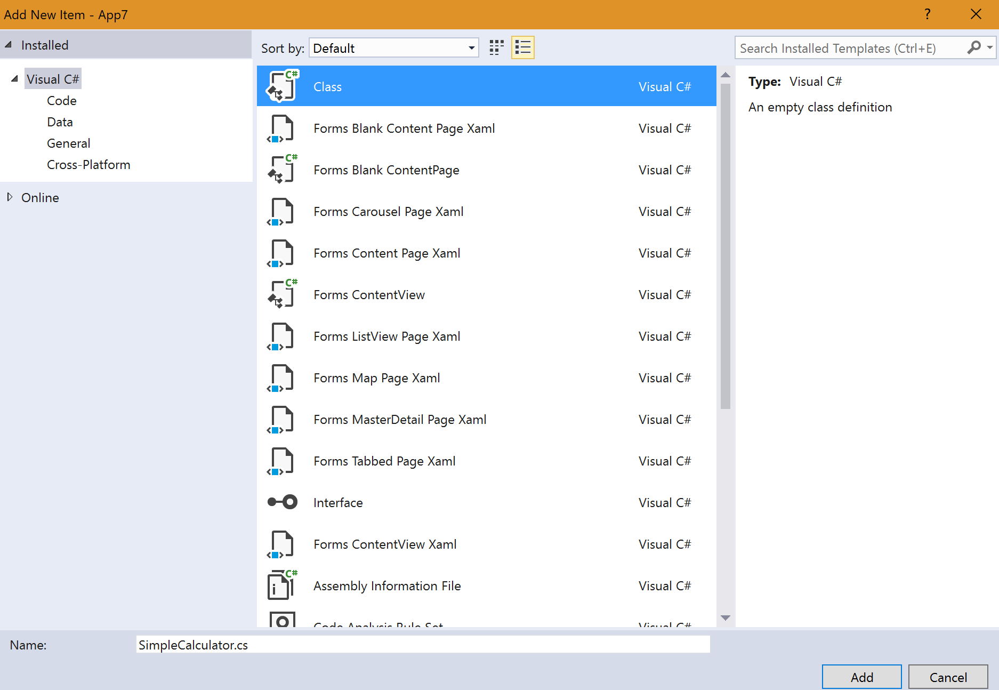

## 130 - Lab2
### 예상 소요시간
15분

### 목표
이 연습에서는 Calculator 프로그램을 수정하여 계산기가 동작하도록 변경합니다.

### 도전
이 연습에서는 XAML에서 만든 Calculator UI를 바탕으로 계산기 기능이 동작하도록 이벤트를 추가하는 실습을 진행합니다. 

## 실습
### SimpleCalculator 클래스 추가
1. **Calculator(Portable)** 프로젝트에서 우클릭 후 **Add > Class** 를 선택한 후 이름에 **SimpleCalculator.cs** 를 입력합니다.


2. 클래스를 **public static**으로 선언하시기 바랍니다. 코드는 다음과 같습니다. 
```
public static class SimpleCalculator
{
}
```

3. double 타입의 변수 2개와 string 타입의 연산자를 받아 계산 결과를 반환할 Calculate 함수를 구현합니다. 구현한 코드는 아래와 같습니다. 
```
public static double Calculate(double value1, double value2, string mathOperator)
{
    double result = 0;

    switch (mathOperator)
    {
        case "/":
            result = value1 / value2;
            break;
        case "X":
            result = value1 * value2;
            break;
        case "+":
            result = value1 + value2;
            break;
        case "-":
            result = value1 - value2;
            break;
    }

    return result;
}
```

### MainPage에 변수 추가
아래의 변수들을 **MainPage.xaml.cs** 클래스에 선언하시기 바랍니다. 
* int currentState = 1;
* string mathOperator;
* double firstNumber, secondNumber;

선언한 후의 **MainPage.xaml.cs** 클래스는 다음과 같습니다. 
```
using System;
using Xamarin.Forms;

namespace Calculator
{
    public partial class MainPage : ContentPage
    {
        int currentState = 1;
        string mathOperator;
        double firstNumber, secondNumber;

        public MainPage()
        {
            InitializeComponent();            
        }
    }
}
```

### Label에 Name 선언하기
계산 결과값을 표시하는데 사용할 변수인 **resultText**를 **MainPage.xaml** Label 내에 추가하시기 바랍니다. 
추가한 후 코드는 아래와 같습니다. 
```
<Label x:Name="resultText" FontAttributes="Bold" FontSize="48" BackgroundColor="Black" Text="0"
    TextColor="White" HorizontalTextAlignment="End" VerticalTextAlignment="Center"
    LineBreakMode="NoWrap" Grid.ColumnSpan="4" />
```

### Button에 Click Event 추가하기 
계산기 숫자를 눌렀을때 버튼이 동작하도록 Event Handler를 추가하는 부분입니다. 

1. **MainPage.xaml**에서 **숫자 0**의 **Button**에다가 **Clicked="OnSelectNumber"** 이벤트를 추가하시기 바랍니다. 추가한 후 **버튼 0**의 코드는 아래와 같습니다.
```
<Button Text="0" Grid.Row="4" Grid.Column="0" Grid.ColumnSpan="3"
    BackgroundColor="White" TextColor="Black"
    FontSize="36" BorderRadius="0" Clicked="OnSelectNumber"/>
```

2. **OnSelectNumber** 이벤트 선언한 부근에서 마우스 오른쪽 버튼 클릭하고, **Go To Definition**을 클릭하면 **Main.xaml.cs**에 메소드가 자동생성됩니다.


3. 2번의 과정중에서 **Clicked="OnSelectNumber"**를 추가하는 부분만 나머지 숫자(1~9) 에도 반복하시기 바랍니다. 2번에서 이미 OnSelectNumber() 메소드를 이미 정의했으므로 "MainPage.xaml.cs"에 별도로 추가하실 필요는 없습니다. 
4. **MainPage.xaml**에서 **(-,+,X,/)**의 **Button**에다가 **Clicked="OnSelectOperator"** 이벤트를 추가하시고, 2번과 같은 방법으로 메소드를 자동생성 하시기 바랍니다.
5. **MainPage.xaml**에서 **Clear Button**에다가 **Clicked="OnClear"** 이벤트를 추가하시고, 2번과 같은 방법으로 메소드를 자동생성 하시기 바랍니다.
6. **MainPage.xaml**에서 **= Button**에다가 **Clicked="OnCalculate"** 이벤트를 추가하시고, 2번과 같은 방법으로 메소드를 자동생성 하시기 바랍니다.
7. 완성한 후의 **MainPage.xaml**코드는 아래와 같습니다.
```
<?xml version="1.0" encoding="utf-8" ?>
<ContentPage xmlns="http://xamarin.com/schemas/2014/forms"
             xmlns:x="http://schemas.microsoft.com/winfx/2009/xaml"
             xmlns:local="clr-namespace:Calculator"
             x:Class="Calculator.MainPage">
    <Grid Padding="5,0" RowSpacing="1" ColumnSpacing="1" BackgroundColor="Black">
        <Grid.RowDefinitions>
            <RowDefinition Height="2*" />
            <RowDefinition Height="*" />
            <RowDefinition Height="*" />
            <RowDefinition Height="*" />
            <RowDefinition Height="*" />
            <RowDefinition Height="*" />
        </Grid.RowDefinitions>

        <Grid.ColumnDefinitions>
            <ColumnDefinition Width="*" />
            <ColumnDefinition Width="*" />
            <ColumnDefinition Width="*" />
            <ColumnDefinition Width="*" />
        </Grid.ColumnDefinitions>

        <Label x:Name="resultText" FontAttributes="Bold" FontSize="48" BackgroundColor="Black" Text="0"
              TextColor="White" HorizontalTextAlignment="End" VerticalTextAlignment="Center"
              LineBreakMode="NoWrap" Grid.ColumnSpan="4" />

        <Button Text="7" Grid.Row="1" Grid.Column="0"
               BackgroundColor="White" TextColor="Black"
               FontSize="36" BorderRadius="0" Clicked="OnSelectNumber"/>
        <Button Text="8" Grid.Row="1" Grid.Column="1"
               BackgroundColor="White" TextColor="Black"
               FontSize="36" BorderRadius="0" Clicked="OnSelectNumber"/>
        <Button Text="9" Grid.Row="1" Grid.Column="2"
               BackgroundColor="White" TextColor="Black"
               FontSize="36" BorderRadius="0" Clicked="OnSelectNumber"/>

        <Button Text="4" Grid.Row="2" Grid.Column="0"
               BackgroundColor="White" TextColor="Black"
               FontSize="36" BorderRadius="0" Clicked="OnSelectNumber"/>
        <Button Text="5" Grid.Row="2" Grid.Column="1"
               BackgroundColor="White" TextColor="Black"
               FontSize="36" BorderRadius="0" Clicked="OnSelectNumber"/>
        <Button Text="6" Grid.Row="2" Grid.Column="2"
               BackgroundColor="White" TextColor="Black"
               FontSize="36" BorderRadius="0" Clicked="OnSelectNumber"/>

        <Button Text="1" Grid.Row="3" Grid.Column="0"
               BackgroundColor="White" TextColor="Black"
               FontSize="36" BorderRadius="0" Clicked="OnSelectNumber"/>
        <Button Text="2" Grid.Row="3" Grid.Column="1"
               BackgroundColor="White" TextColor="Black"
               FontSize="36" BorderRadius="0" Clicked="OnSelectNumber"/>
        <Button Text="3" Grid.Row="3" Grid.Column="2"
               BackgroundColor="White" TextColor="Black"
               FontSize="36" BorderRadius="0" Clicked="OnSelectNumber"/>
        <Button Text="0" Grid.Row="4" Grid.Column="0" Grid.ColumnSpan="3"
               BackgroundColor="White" TextColor="Black"
               FontSize="36" BorderRadius="0" Clicked="OnSelectNumber"/>

        <Button Text="/" Grid.Row="1" Grid.Column="3"
                BackgroundColor="#FFA500" TextColor="White"
                FontSize="36" BorderRadius="0" Clicked="OnSelectOperator"/>
        <Button Text="X" Grid.Row="2" Grid.Column="3"
                BackgroundColor="#FFA500" TextColor="White"
                FontSize="36" BorderRadius="0" Clicked="OnSelectOperator"/>
        <Button Text="-" Grid.Row="3" Grid.Column="3"
                BackgroundColor="#FFA500" TextColor="White"
                FontSize="36" BorderRadius="0" Clicked="OnSelectOperator"/>
        <Button Text="+" Grid.Row="4" Grid.Column="3"
                BackgroundColor="#FFA500" TextColor="White"
                FontSize="36" BorderRadius="0" Clicked="OnSelectOperator"/>

        <Button Text="C" Grid.Row="5" Grid.Column="0"
                BackgroundColor="#808080" TextColor="White"
                FontSize="36" BorderRadius="0" Clicked="OnClear"/>

        <Button Text="=" Grid.Row="5" Grid.Column="1" Grid.ColumnSpan="3"
                BackgroundColor="#FFA500" TextColor="White"
                FontSize="36" BorderRadius="0" Clicked="OnCalculate"/>
    </Grid>
</ContentPage>
```

### Event Handler 구현하기
**MainPage.xaml.cs** 파일에 있는 이벤트 메소드들을 정의하는 부분입니다. 

1. OnSelectNumber 메소드 
숫자 버튼을 누르면 눌린 숫자 버튼을 인식하는 메소드 입니다. 코드는 아래와 같습니다. 
```
void OnSelectNumber(object sender, EventArgs e)
{
    Button button = (Button)sender;
    string pressed = button.Text;

    if (this.resultText.Text == "0" || currentState < 0) {
        this.resultText.Text = "";
        if (currentState < 0)
            currentState *= -1;
    }

    this.resultText.Text += pressed;

    double number;
    if (double.TryParse(this.resultText.Text, out number)) {
        this.resultText.Text = number.ToString("N0");
        if (currentState == 1) {
            firstNumber = number;
        } else {
            secondNumber = number;
        }
    }
}
```

2. OnSelectOperator 메소드
**+,-,X,/** 연산자를 인식하고 변환하는 메소드 입니다. 
```
private void OnSelectOperator(object sender, EventArgs e)
{
    currentState = -2;
    Button button = (Button)sender;
    string pressed = button.Text;
    mathOperator = pressed;

}
```

3. OnClear 메소드
계산한 내용을 초기화 하는 부분입니다.
```
void OnClear(object sender, EventArgs e)
{
    firstNumber = 0;
    secondNumber = 0;
    currentState = 1;
    this.resultText.Text = "0";
}
```

4. OnCalculate 메소드 
Calculate 함수를 이용하여 연산을 수행하고, 결과값을 resultText에 반영하는 부분입니다. 
```
void OnCalculate(object sender, EventArgs e)
{
    if (currentState == 2)
    {
        var result = SimpleCalculator.Calculate(firstNumber, secondNumber, mathOperator);	

        this.resultText.Text = result.ToString("N0");
        firstNumber = result;
        currentState = -1;
    }
}
```

5. 초기화 함수 설정
**InitializeComponent()** 아래 부분에 값을 초기화하는 함수인 **OnClear()** 함수를 추가합니다.
완성된 모습은 아래와 같습니다. 
```
public MainPage()
{
    InitializeComponent();
    OnClear(this,null);
}
```

6. 완성 후의 **MainPage.xaml.cs**코드는 다음과 같습니다. 
```
using System;
using Xamarin.Forms;

namespace Calculator
{
    public partial class MainPage : ContentPage
    {
        int currentState = 1;
        string mathOperator;
        double firstNumber, secondNumber;

        public MainPage()
        {
            InitializeComponent();
            OnClear(this,null);
        }

        private void OnSelectNumber(object sender, EventArgs e)
        {
            Button button = (Button)sender;
            string pressed = button.Text;

            if (this.resultText.Text == "0" || currentState < 0)
            {
                this.resultText.Text = "";
                if (currentState < 0)
                    currentState *= -1;
            }

            this.resultText.Text += pressed;

            double number;
            if (double.TryParse(this.resultText.Text, out number))
            {
                this.resultText.Text = number.ToString("N0");
                if (currentState == 1)
                {
                    firstNumber = number;
                }
                else
                {
                    secondNumber = number;
                }
            }
        }

        private void OnSelectOperator(object sender, EventArgs e)
        {
            currentState = -2;
            Button button = (Button)sender;
            string pressed = button.Text;
            mathOperator = pressed;

        }

        private void OnClear(object sender, EventArgs e)
        {
            firstNumber = 0;
            secondNumber = 0;
            currentState = 1;
            this.resultText.Text = "0";

        }

        private void OnCalculate(object sender, EventArgs e)
        {
            if (currentState == 2)
            {
                var result = SimpleCalculator.Calculate(firstNumber, secondNumber, mathOperator);

                this.resultText.Text = result.ToString("N0");
                firstNumber = result;
                currentState = -1;
            }
        }
    }
}

```

7. 애플리케이션 실행
변경사항을 저장한 후 애플리케이션을 실행해보면 계산기가 제대로 작동하는 것을 확인하실 수 있습니다. 

