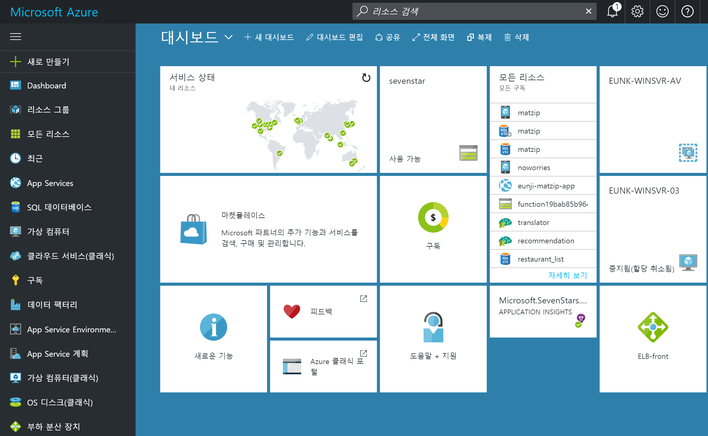
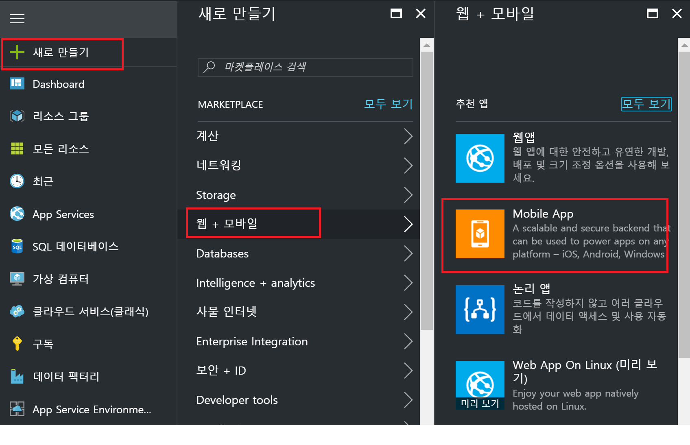
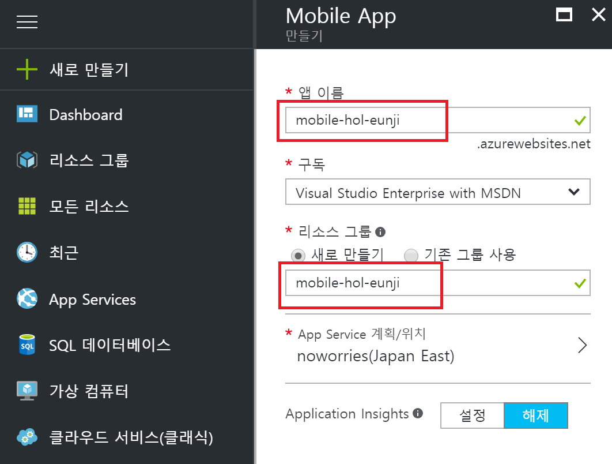
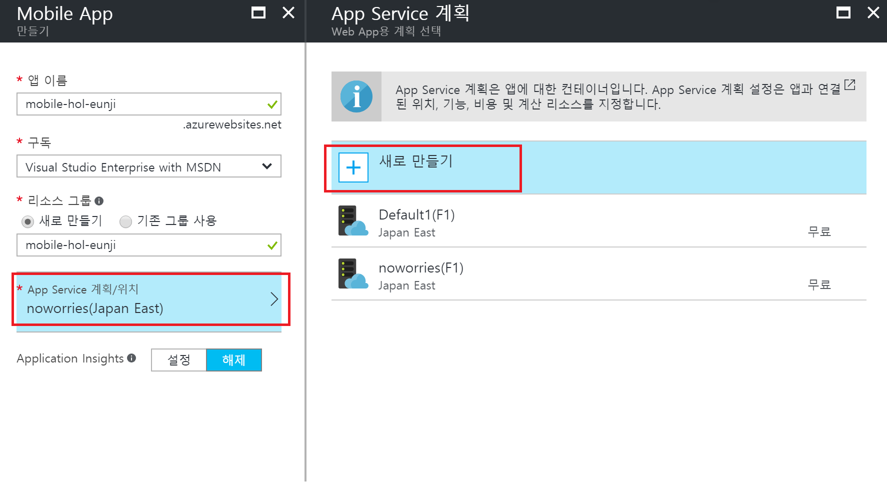
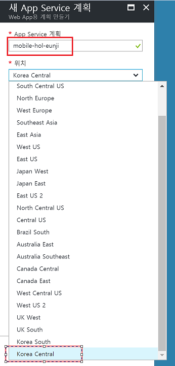
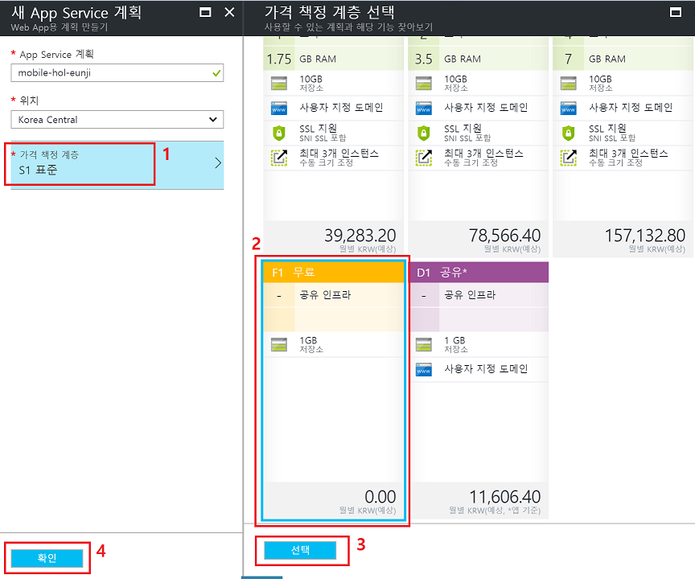
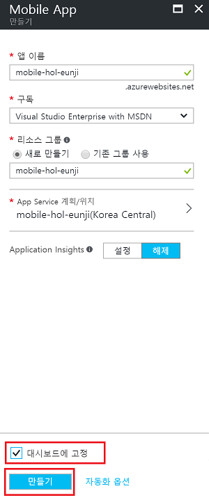
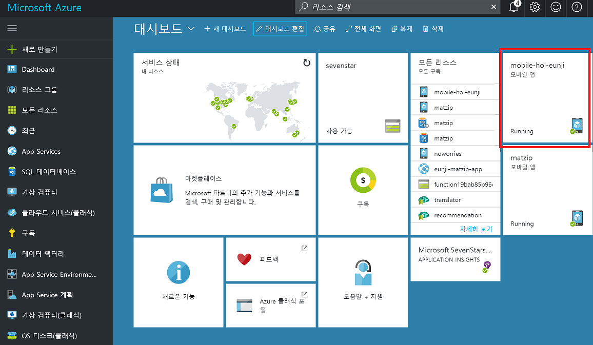

## AZR120 - Azure Mobile Backend 생성하기 

이번 튜토리얼에서는 마이크로소프트의 클라우드 서비스인 Azure의 Mobile App을 이용하여 여러분이 생성하신 애플리케이션에 Facebook 인증을 붙이는 예제를 함께 해볼 예정입니다. 
Azure Mobile App 이란, 모바일 개발시 꼭 필요로 하는 기능인 인증, 푸쉬알림, 오프라인 싱크 등등의 서비스를 쉽고 빠르게 만들수 있도록 도와주는 서비스입니다.
이번 실습에서 해볼 내용은 Azure Mobile App의 인증을 이용하여 Xamarin 애플리케이션에 Facebook 인증을 붙여 보도록 하겠습니다. 

* [Lab 1 - Azure Mobile App 생성하기](https://github.com/angie4u/xamarin-hol/blob/master/AZR120-Azure%20Mobile%20App/AZR120_Lab1.md) 
* [Lab 2 - Xamarin.Forms 프로젝트 생성 및 필요한 패키지 설치하기](https://github.com/angie4u/xamarin-hol/blob/master/AZR120-Azure%20Mobile%20App/AZR120_Lab2.md) 
* [Lab 3 - Facebook 개발자 페이지에서 내 앱 추가](https://github.com/angie4u/xamarin-hol/blob/master/AZR120-Azure%20Mobile%20App/AZR120_Lab3.md)
* [Lab 4 - Azure Mobile SDK에서 제공하는 메소드를 이용하여 Facebook 인증 구현하기](https://github.com/angie4u/xamarin-hol/blob/master/AZR120-Azure%20Mobile%20App/AZR120_Lab4.md) 

* [Azure 모바일 앱의 인증 및 권한 부여](https://docs.microsoft.com/ko-kr/azure/app-service-mobile/app-service-mobile-auth)

### 예상 소요시간
10분

### 목표
Azure Mobile App을 생성해보자

## 실습과정
### Azure Mobile App 생성하기 

1. 인터넷 주소창에 [portal.azure.com](https://portal.azure.com) 을 입력하고 로그인하여 Azure Portal에 접속합니다. 

2. 좌측의 **새로만들기 -> 웹+모바일 -> Mobile App**을 선택합니다.

3. 아래와 같이 입력합니다
* 앱이름: **mobile-hol-XXXX** (XXXX를 자신만의 이니셜로 바꾸시기 바랍니다)
* 구독: (기존에 선택되어 있는 정보 그대로 두기)
* 리소스 이름: **mobile-hol-XXXX** (새로만들기, 앱 이름과 동일하게 입력)

4. **App Service 계획/위치**를 선택하고 **새로만들기**를 선택합니다.

5. 다음과 같이 입력하고 선택합니다.
* App Service 계획:  **mobile-hol-XXXX** (앱 이름과 동일하게 입력)
* 위치: **Korea Central** 선택

6. **가격 책정 계층**탭을 확대하고 **F1 무료**를 **선택**한후 **확인**버튼을 눌러 완료합니다.

7. **대시보드에 고정**을 선택하고 **확인**을 눌러 Mobile App 생성을 완료합니다.

8. **대시보드**에 생성된 Mobile App을 선택합니다.

9. Mobile App이 잘 생성된 것을 확인하실 수 있습니다.

