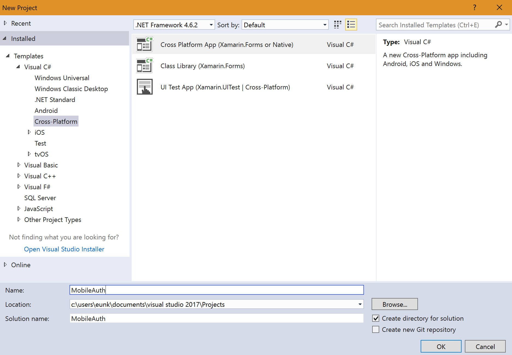
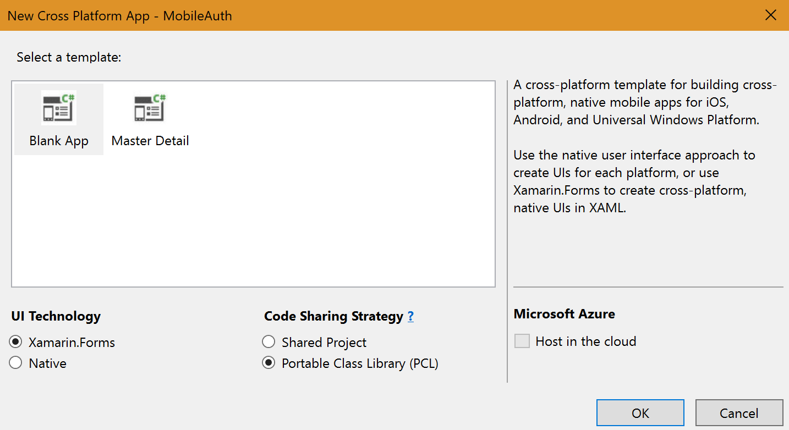
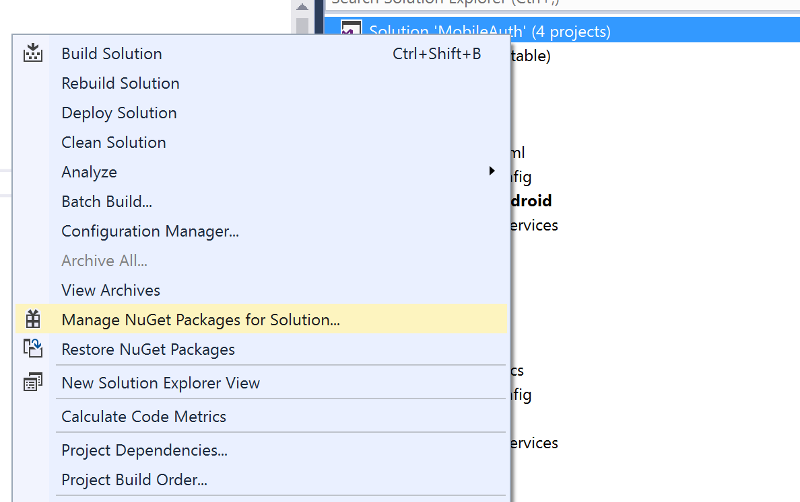
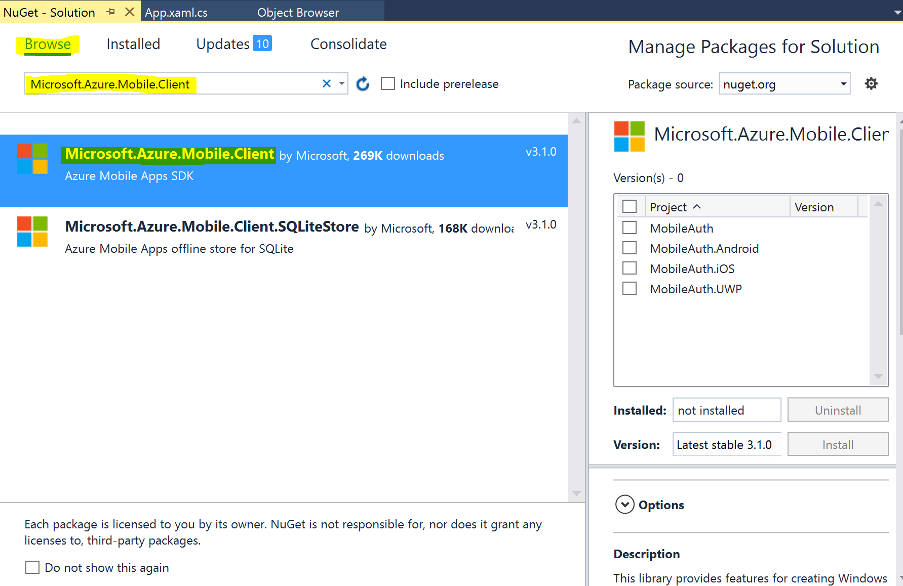
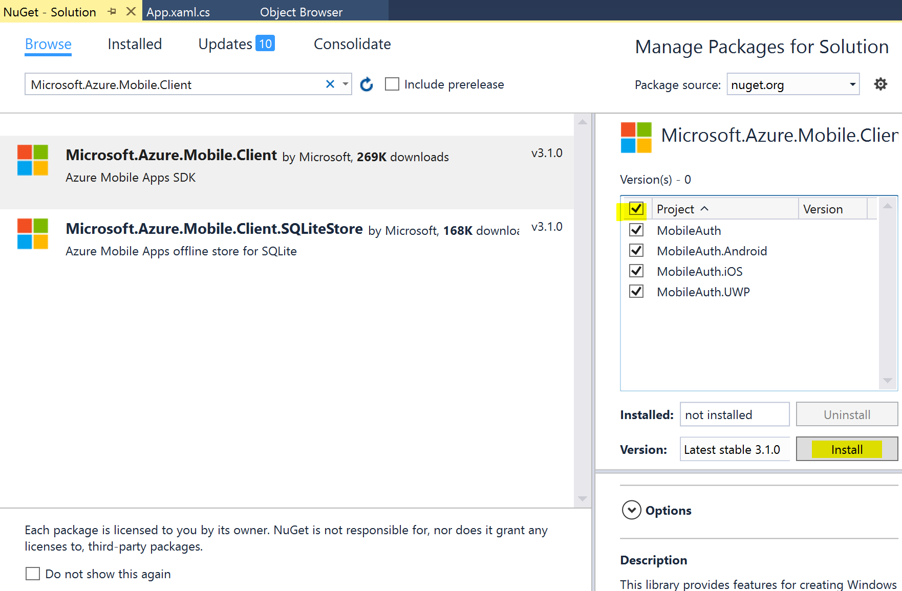
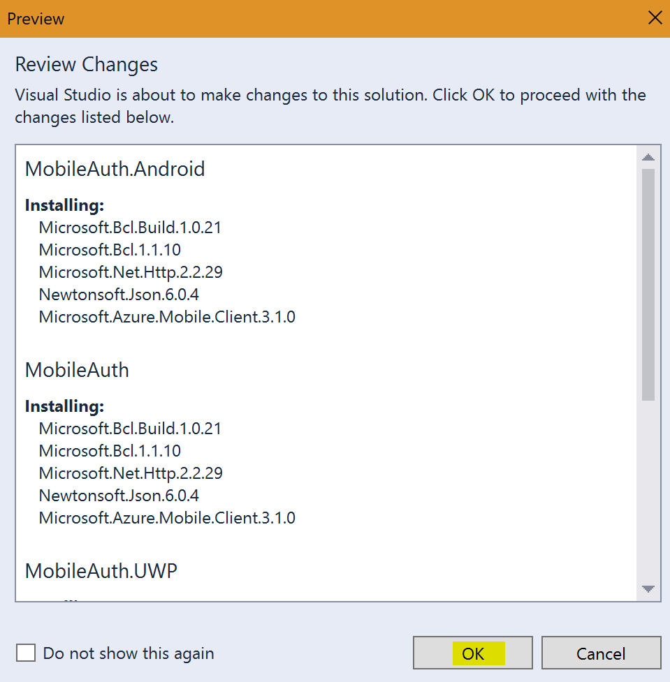
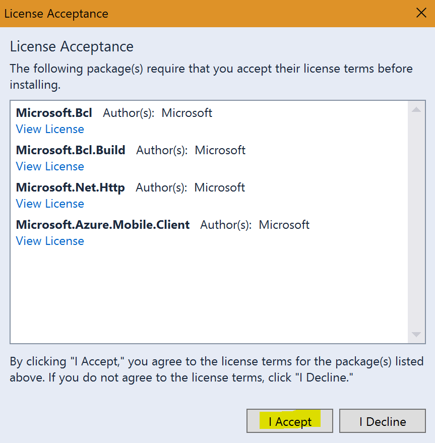

## AZR120 - Azure Mobile Backend 생성하기 

이번 튜토리얼에서는 마이크로소프트의 클라우드 서비스인 Azure의 Mobile App을 이용하여 여러분이 생성하신 애플리케이션에 Facebook 인증을 붙이는 예제를 함께 해볼 예정입니다. 
Azure Mobile App 이란, 모바일 개발시 꼭 필요로 하는 기능인 인증, 푸쉬알림, 오프라인 싱크 등등의 서비스를 쉽고 빠르게 만들수 있도록 도와주는 서비스입니다.
이번 실습에서 해볼 내용은 Azure Mobile App의 인증을 이용하여 Xamarin 애플리케이션에 Facebook 인증을 붙여 보도록 하겠습니다. 

* [Lab 1 - Azure Mobile App 생성하기](https://github.com/angie4u/xamarin-hol/blob/master/AZR120-Azure%20Mobile%20App/AZR120_Lab1.md) 
* [Lab 2 - Xamarin.Forms 프로젝트 생성 및 필요한 패키지 설치하기](https://github.com/angie4u/xamarin-hol/blob/master/AZR120-Azure%20Mobile%20App/AZR120_Lab2.md) 
* [Lab 3 - Facebook 개발자 페이지에서 내 앱 추가](https://github.com/angie4u/xamarin-hol/blob/master/AZR120-Azure%20Mobile%20App/AZR120_Lab3.md)
* [Lab 4 - Azure Mobile SDK에서 제공하는 메소드를 이용하여](https://github.com/angie4u/xamarin-hol/blob/master/AZR120-Azure%20Mobile%20App/AZR120_Lab4.md) 

### 예상 소요시간
20분

### 목표
Xamarin.Forms 프로젝트 생성 및 필요한 패키지 설치

## 실습과정
### 프로젝트 생성하기
**MobileAuth**라는 이름의 프로젝트를 생성하고 실행하시기 바랍니다.

### 패키지 추가하기

1. 솔루션인 **MobileAuth** 에서 마우스 오른쪽을 클릭하고 **Manage NuGet Packages for Solution**을 클릭합니다.

2. **Browse** 탭에서 검색창에 **Microsoft.Azure.Mobile.Client**를 입력하고 가장 상단에 표시되는 아래의 스크린샷과 같은 패키지를 선택합니다.

3. 우측의 화면에서 **MobileAuth, MobileAuth.Android, MobileAuth.iOS, MobileAuth.UWP** 프로젝트를 모두 선택하고 **Install**버튼을 눌러 설치를 진행하시기 바랍니다.

4. **OK** 및 **I Accept** 버튼을 눌러서 설치 진행을 완료하시기 바랍니다.

