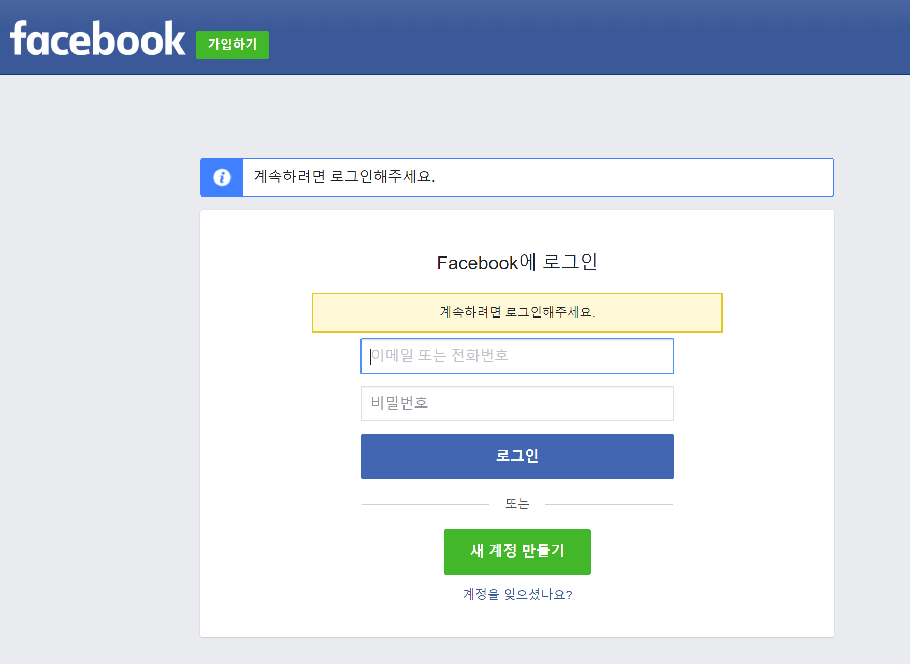
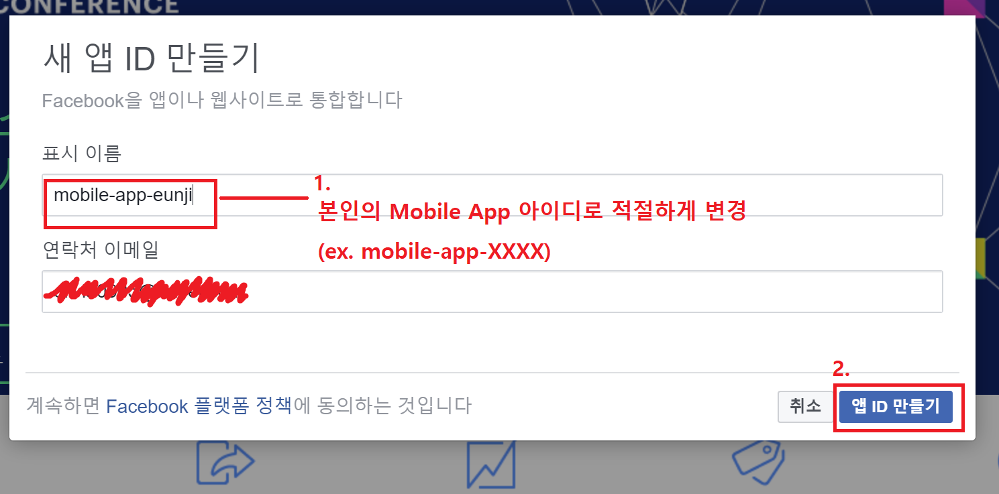
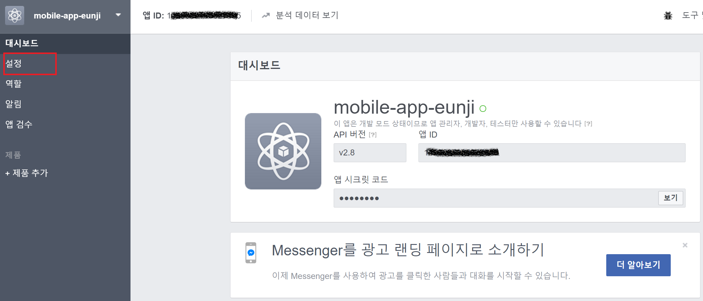
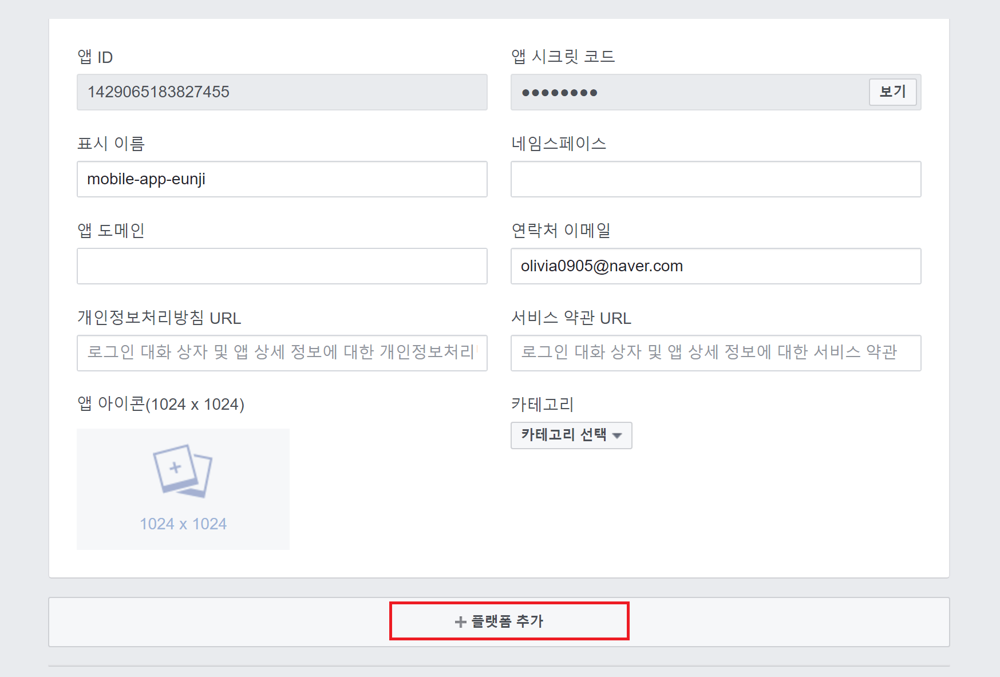
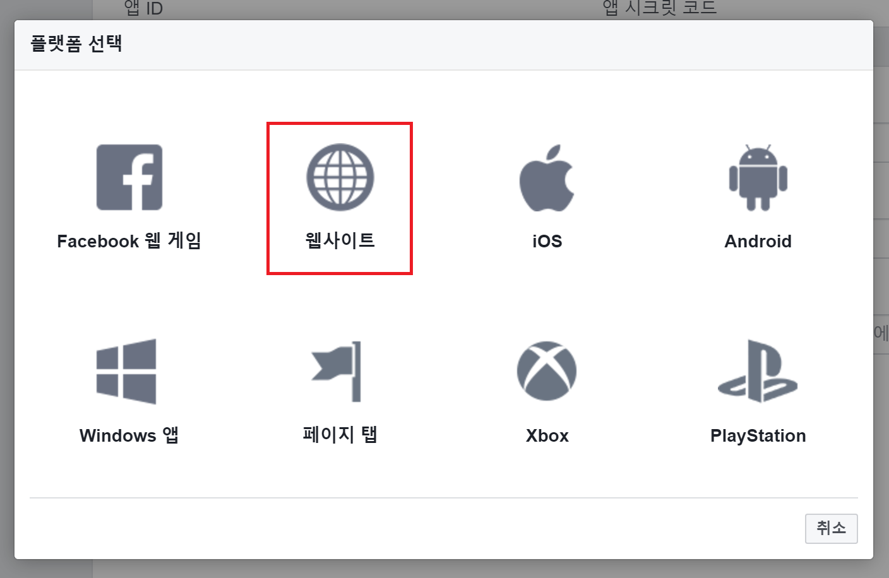
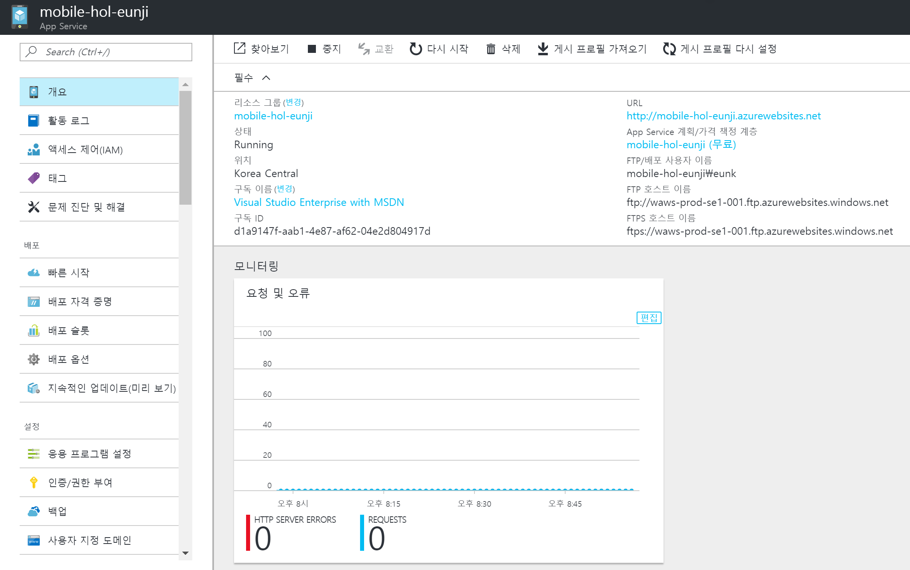
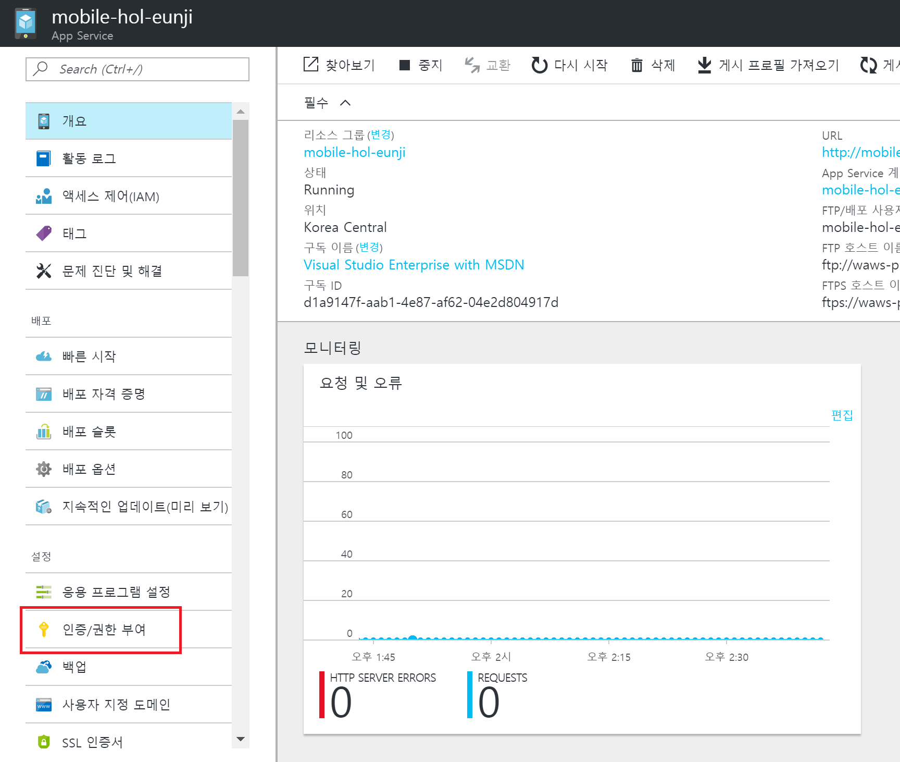
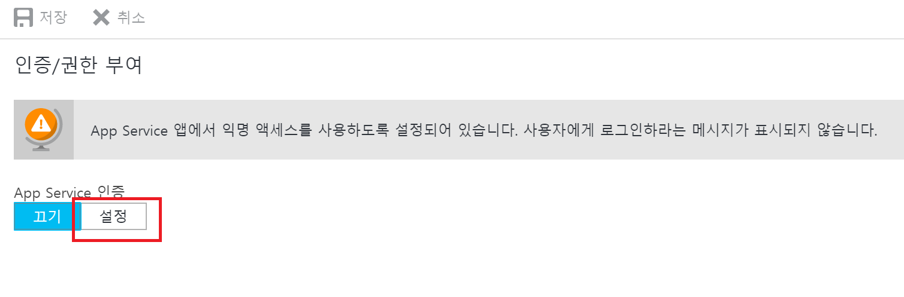
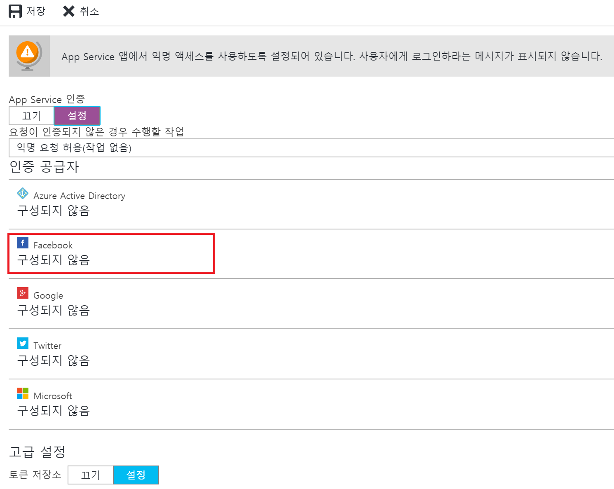

## AZR120 - Azure Mobile Backend 생성하기 
### 예상 소요시간
15분

### 목표
Azure Mobile App에 Identity Service Provider - Facebook 인증 연동하기

## 실습과정
### Facebook 인증 설정에 필요한 앱 ID/ 앱 암호 값 생성하기

1. Facebook 개발자 페이지인 [https://developers.facebook.com/](https://developers.facebook.com/)에 접속합니다.

2. Facebook 계정을 이용하여 로그인 합니다.

3. 우측 상단의 **내 앱 -> 새 앱 추가** 버튼을 선택 하시기 바랍니다.

4. 새 앱 ID 만들기에서 표시이름에 **mobile-app-XXXX**와 같이 표시될 이름으로 적절하게 입력하시고 **앱 ID 만들기**버튼을 눌러서 새 앱을 생성하시기 바랍니다.

5. 좌측의 메뉴에서 **설정**을 선택합니다.

6. 설정 탭에서 아래쪽에 위치한 **+플랫폼 추가** 를 선택합니다.

7. 플랫폼 선택에서 **웹사이트** 를 선택합니다.

8. 사이트 URL에 **https://(여러분의 Mobile App 이름).azurewebsites.net/.auth/login/facebook/callback** 을 입력하시고, 변경 내용 저장 버튼을 누르시기 바랍니다.

9. 페이지 상단에 위치한 **앱 ID**와 **앱 시크릿 코드**를 기록해 둡니다.

### Azure Mobile App에 Facebook - 앱ID, 앱 시크릿 코드 입력하기

1. [Azure Portal](https://portal.azure.com)에서 생성한 Mobile App 페이지로 이동합니다.

2. Mobile App 페이지 좌측의 메뉴에서 **인증/권한 부여**를 선택하시기 바랍니다.

3. App Service 인증의 버튼을 **설정** 상태로 변경합니다. 

4. Facebook 인증을 선택합니다.

5. Facebook 인증 설정 페이지에서 위에서 생성한 **앱 ID** 및 **앱 암호**를 입력하고 확인 버튼을 누릅니다. 

6. 인증 공급자에서 Facebook이 **구성됨** 상태임을 확인한 후, **저장** 버튼을 눌러서 인증/권한 정보 변경을 완료하시기 바랍니다.

