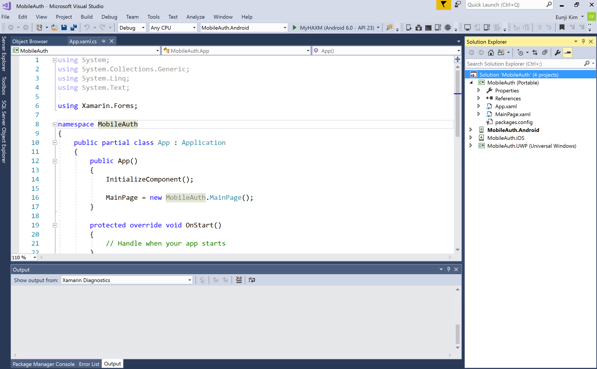
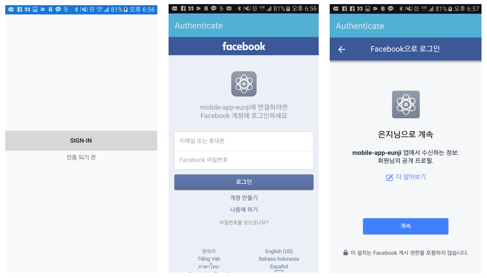
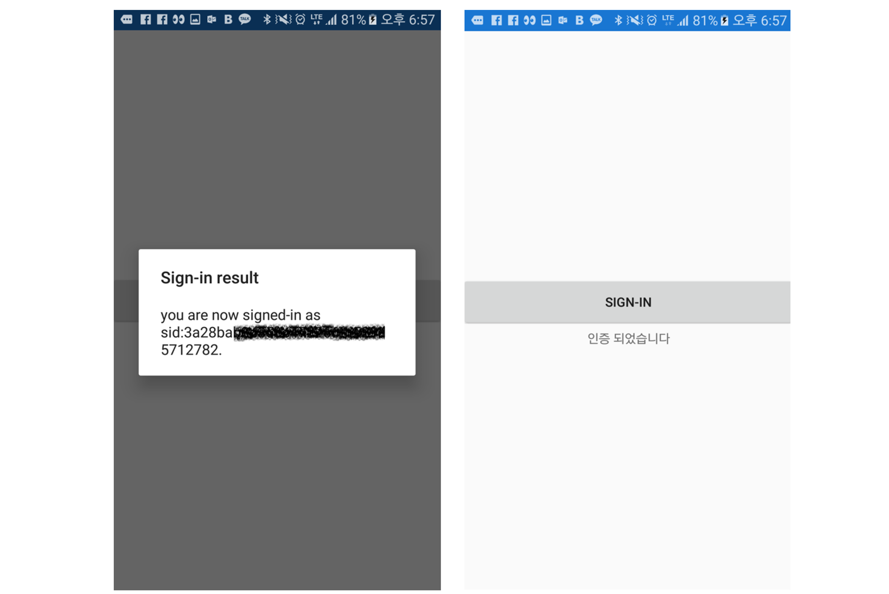
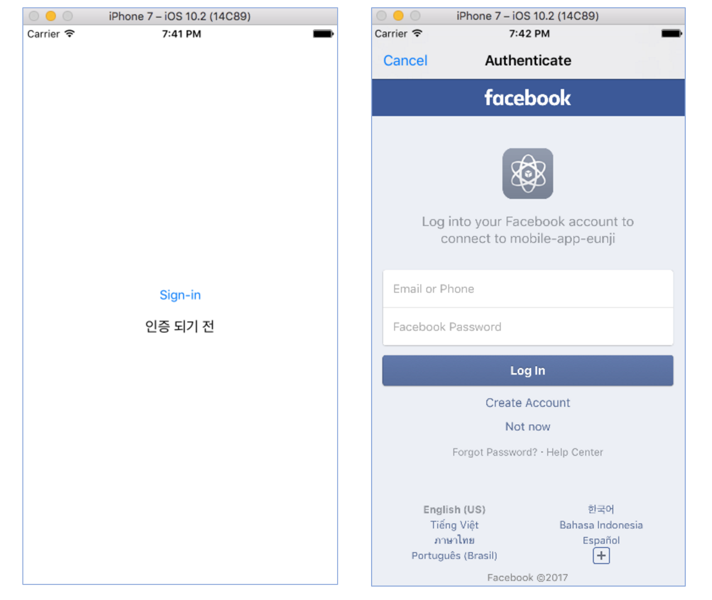
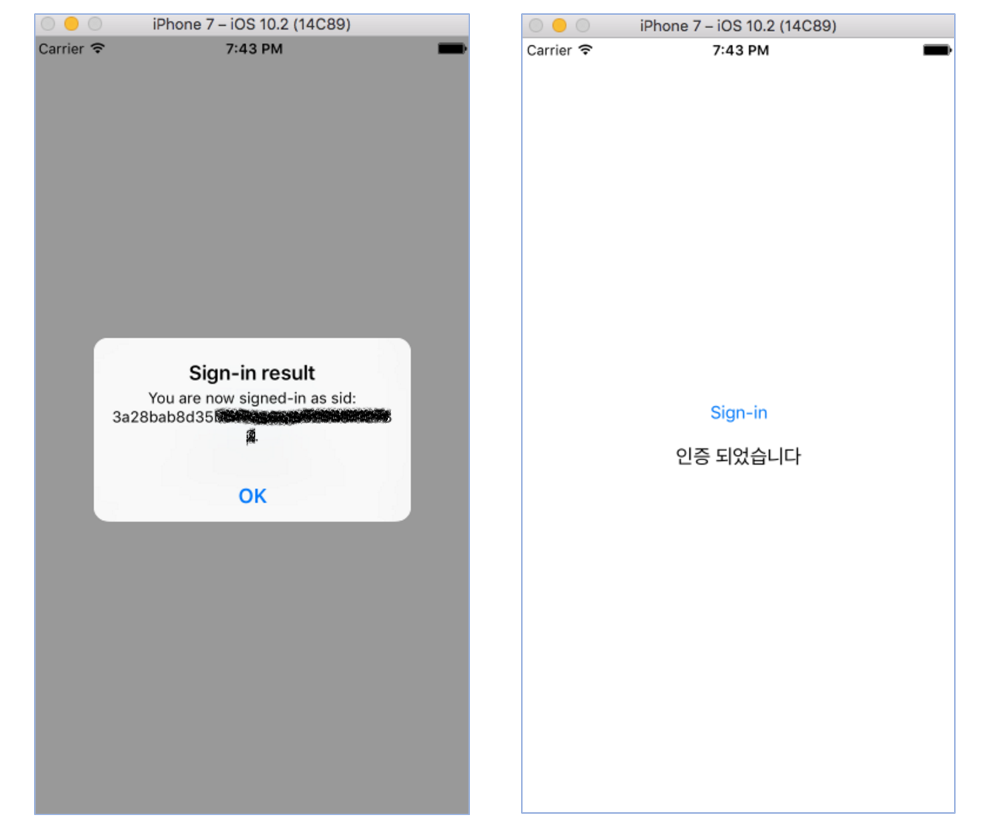
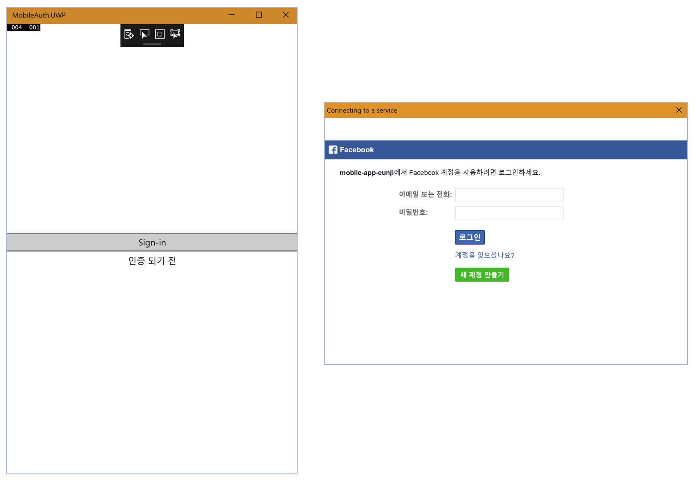
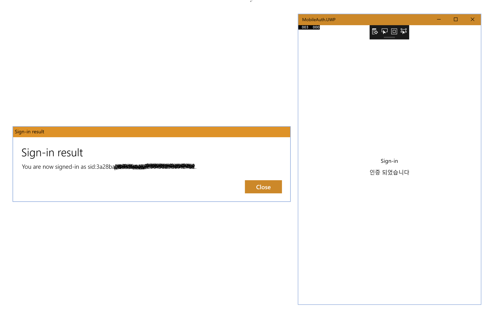

## AZR120 - Azure Mobile Backend 생성하기 
### 예상 소요시간
30분

### 목표
Azure Mobile App의 Authenticate 서비스를 이용하여 페이스북 인증 구현하기 

## 실습과정
### Mobile App 인증기능 구현하기 - IAuthenticate 인터페이스 선언  

1. [Lab2](https://github.com/angie4u/xamarin-hol/blob/master/AZR120-Azure%20Mobile%20App/AZR120_Lab2.md) 에서 만들었던 **MobileAuth**프로젝트를 오픈하시기 바랍니다.



2. **App.xaml.cs** 파일을 오픈하시고 상단에 다음의 네임스페이스를 추가하시기 바랍니다. 

```
using System.Threading.Tasks;
```

3. App 클래스 정의 윗 부분에 IAuthenticate 인터페이스를 정의하기 위해 다음의 코드를 추가하시기 바랍니다.
```
public interface IAuthenticate
{
    Task<bool> Authenticate();
}
```

4. 인터페이스를 초기화하기 위해서 App 클래스 내부에 다음의 코드를 추가하시기 바랍니다.
```
public static IAuthenticate Authenticator { get; private set; }

public static void Init(IAuthenticate authenticator)
{
    Authenticator = authenticator;
}
```

5. 완성된 App.xaml.cs 파일은 다음과 같습니다.
```
using System;
using System.Collections.Generic;
using System.Linq;
using System.Text;
using System.Threading.Tasks;
using Xamarin.Forms;

namespace MobileAuth
{
    public partial class App : Application
    {
        public interface IAuthenticate
        {
            Task<bool> Authenticate();
        }

        public static IAuthenticate Authenticator { get; private set; }

        public static void Init(IAuthenticate authenticator)
        {
            Authenticator = authenticator;
        }

        public App()
        {
            InitializeComponent();

            MainPage = new MobileAuth.MainPage();
        }

        protected override void OnStart()
        {
            // Handle when your app starts
        }

        protected override void OnSleep()
        {
            // Handle when your app sleeps
        }

        protected override void OnResume()
        {
            // Handle when your app resumes
        }
    }
}
```

5. **MobileAuth(Portable)** 프로젝트에서 **MainPage.xaml** 파일을 열고, 기존에 생성되어있는 **Label을 주석처리** 합니다. 코드는 다음과 같습니다. 
```
<!--<Label Text="Welcome to Xamarin Forms!" 
           VerticalOptions="Center" 
           HorizontalOptions="Center" />-->
```

6. **ContentPage** 내부에 로그인 버튼 및 상태를 표기할 Label을 추가하시기 바랍니다. 코드는 다음과 같습니다.
```
<StackLayout VerticalOptions="Center">
    <Button x:Name="loginButton" Text="Sign-in" MinimumHeightRequest="30"
            Clicked="loginButton_Clicked"/>
    <Label x:Name="authLabel" Text="인증 되기 전" HorizontalTextAlignment="Center"/>
</StackLayout>
```

7. **MainPage.xaml.cs** 파일을 여시고, 클래스 내부에 인증 되었는지 여부를 확인하기 위한 bool 변수를 선언합니다. 
```
//인증 여부용 bool 변수
bool authenticated = false;
```

8. 클래스 내부에 로그인 버튼이 클릭되었을 때 인증을 처리할 메소드 및 OnAppearing 메소드를 추가하시기 바랍니다. 
```
async void loginButton_Clicked(object sender, EventArgs e)
{
    if (App.Authenticator != null)
        authenticated = await App.Authenticator.Authenticate();

    if(authenticated == true)
        authLabel.Text = "인증 되었습니다";
}


protected override void OnAppearing()
{
    base.OnAppearing();

    if(authenticated == true)
    {
        authLabel.Text = "인증 되었습니다";
        this.loginButton.IsVisible = false;
    }
}
```

9. 완성된 **MainPage.xaml.cs** 코드는 다음과 같습니다.
```
using System;
using Xamarin.Forms;

namespace MobileAuth
{
    public partial class MainPage : ContentPage
    {
        //인증 여부용 bool 변수
        bool authenticated = false;

        public MainPage()
        {
            InitializeComponent();
        }

        async void loginButton_Clicked(object sender, EventArgs e)
        {
            if (App.Authenticator != null)
                authenticated = await App.Authenticator.Authenticate();

            if (authenticated == true)
                authLabel.Text = "인증 되었습니다";
        }


        protected override void OnAppearing()
        {
            base.OnAppearing();

            if (authenticated == true)
            {
                authLabel.Text = "인증 되었습니다";
                this.loginButton.IsVisible = false;
            }
        }
    }
}
```

## Mobile App 인증기능 구현하기 - 플랫폼 별 프로젝트에서 인터페이스 구현 
### Android 

1. **MobileAuth.Android** 프로젝트에서 **MainActivity.cs** 클래스를 열고 상단에 다음의 using 구문을 추가합니다.
```
using Microsoft.WindowsAzure.MobileServices;
using System.Threading.Tasks;
using static MobileAuth.App;
``` 

2. IAuthenticate 인터페이스를 구현하도록 다음과 같이 MainActivity 클래스를 업데이트 합니다.
```
public class MainActivity : global::Xamarin.Forms.Platform.Android.FormsApplicationActivity, IAuthenticate
```

3. MainActivity 클래스 내부에 다음의 코드를 추가하여 IAthenticate 인터페이스의 Authenticate() 메소드 구현을 완료합니다.
```
private MobileServiceUser user;
MobileServiceClient client = new MobileServiceClient("여러분이 생성한 Mobile App 주소");

public async Task<bool> Authenticate()
{
    var success = false;
    var message = string.Empty;

    try
    {
        user = await client.LoginAsync(this, MobileServiceAuthenticationProvider.Facebook);
        if (user != null)
        {
            message = string.Format("you are now signed-in as {0}.",
                user.UserId);
            success = true;
        }
    }
    catch (Exception ex)
    {
        message = ex.Message;
    }

    // Display the success or failure message.
    AlertDialog.Builder builder = new AlertDialog.Builder(this);
    builder.SetMessage(message);
    builder.SetTitle("Sign-in result");
    builder.Create().Show();

    return success;
}
```

4. OnCreate() 메소드 내부의 LoadApplication(new App()) 윗 부분에 다음의 명령어를 추가합니다.
```
App.Init((IAuthenticate)this);
```

5. 완성된 **MainActivity.cs** 클래스는 다음과 같습니다.
```
using System;

using Android.App;
using Android.Content.PM;
using Android.Runtime;
using Android.Views;
using Android.Widget;
using Android.OS;

using Microsoft.WindowsAzure.MobileServices;
using System.Threading.Tasks;
using static MobileAuth.App;

namespace MobileAuth.Droid
{
    [Activity(Label = "MobileAuth", Icon = "@drawable/icon", Theme = "@style/MainTheme", MainLauncher = true, ConfigurationChanges = ConfigChanges.ScreenSize | ConfigChanges.Orientation)]
    public class MainActivity : global::Xamarin.Forms.Platform.Android.FormsAppCompatActivity, IAuthenticate
    {
        protected override void OnCreate(Bundle bundle)
        {
            TabLayoutResource = Resource.Layout.Tabbar;
            ToolbarResource = Resource.Layout.Toolbar;

            base.OnCreate(bundle);

            global::Xamarin.Forms.Forms.Init(this, bundle);
            LoadApplication(new App());
        }

        private MobileServiceUser user;
        MobileServiceClient client = new MobileServiceClient("여러분이 생성한 Mobile App 주소");

        public async Task<bool> Authenticate()
        {
            var success = false;
            var message = string.Empty;

            try
            {
                user = await client.LoginAsync(this, MobileServiceAuthenticationProvider.Facebook);
                if (user != null)
                {
                    message = string.Format("you are now signed-in as {0}.",
                        user.UserId);
                    success = true;
                }
            }
            catch (Exception ex)
            {
                message = ex.Message;
            }

            // Display the success or failure message.
            AlertDialog.Builder builder = new AlertDialog.Builder(this);
            builder.SetMessage(message);
            builder.SetTitle("Sign-in result");
            builder.Create().Show();

            return success;
        }
    }
}
``` 

6. 실행 결과는 다음과 같습니다.





### iOS
1. **MobileAuth.Android** 프로젝트에서 **AppDelegate.cs** 클래스를 열고 상단에 다음의 using 구문을 추가합니다.
```
using Microsoft.WindowsAzure.MobileServices;
using System.Threading.Tasks;
using static MobileAuth.App;
``` 

2. IAuthenticate 인터페이스를 구현하도록 다음과 같이 AppDelegate 클래스를 업데이트 합니다.
```
public partial class AppDelegate : global::Xamarin.Forms.Platform.iOS.FormsApplicationDelegate, IAuthenticate
```

3. AppDelegate 클래스 내부에 다음의 코드를 추가하여 IAthenticate 인터페이스의 Authenticate() 메소드 구현을 완료합니다.
```
private MobileServiceUser user;
MobileServiceClient client = new MobileServiceClient("여러분이 생성한 Mobile App 주소, http->https로 변경할 것");

public async Task<bool> Authenticate()
{
    var success = false;
    var message = string.Empty;
    try
    {
        // Sign in with Facebook login using a server-managed flow.
        if (user == null)
        {
            user = await client.LoginAsync(UIApplication.SharedApplication.KeyWindow.RootViewController,
                MobileServiceAuthenticationProvider.Facebook);
            if (user != null)
            {
                message = string.Format("You are now signed-in as {0}.", user.UserId);
                success = true;
            }
        }
    }
    catch (Exception ex)
    {
        message = ex.Message;
    }

    // Display the success or failure message.
    UIAlertView avAlert = new UIAlertView("Sign-in result", message, null, "OK", null);
    avAlert.Show();

    return success;
}
```

4. FinishedLaunching() 메소드 내부의 LoadApplication(new App()) 윗 부분에 다음의 명령어를 추가합니다.
```
App.Init(this);
```

5. 완성된 **AppDelegate.cs** 클래스는 다음과 같습니다.
```
using System;
using System.Collections.Generic;
using System.Linq;

using Foundation;
using UIKit;

using Microsoft.WindowsAzure.MobileServices;
using System.Threading.Tasks;
using static MobileAuth.App;

namespace MobileAuth.iOS
{
    // The UIApplicationDelegate for the application. This class is responsible for launching the 
    // User Interface of the application, as well as listening (and optionally responding) to 
    // application events from iOS.
    [Register("AppDelegate")]
    public partial class AppDelegate : global::Xamarin.Forms.Platform.iOS.FormsApplicationDelegate, IAuthenticate
    {
        private MobileServiceUser user;
        MobileServiceClient client = new MobileServiceClient("여러분이 생성한 Mobile App 주소, http->https로 변경할 것");

        public async Task<bool> Authenticate()
        {
            var success = false;
            var message = string.Empty;
            try
            {
                // Sign in with Facebook login using a server-managed flow.
                if (user == null)
                {
                    user = await client.LoginAsync(UIApplication.SharedApplication.KeyWindow.RootViewController,
                        MobileServiceAuthenticationProvider.Facebook);
                    if (user != null)
                    {
                        message = string.Format("You are now signed-in as {0}.", user.UserId);
                        success = true;
                    }
                }
            }
            catch (Exception ex)
            {
                message = ex.Message;
            }

            // Display the success or failure message.
            UIAlertView avAlert = new UIAlertView("Sign-in result", message, null, "OK", null);
            avAlert.Show();

            return success;
        }

        //
        // This method is invoked when the application has loaded and is ready to run. In this 
        // method you should instantiate the window, load the UI into it and then make the window
        // visible.
        //
        // You have 17 seconds to return from this method, or iOS will terminate your application.
        //
        public override bool FinishedLaunching(UIApplication app, NSDictionary options)
        {
            global::Xamarin.Forms.Forms.Init();

            App.Init(this);
            LoadApplication(new App());

            return base.FinishedLaunching(app, options);
        }
    }
}
```

6. 실행 결과는 다음과 같습니다.





### UWP (= Windows 10)

1. **MobileAuth.UWP** 프로젝트에서 **MainPage.xaml.cs** 클래스를 열고 상단에 다음의 using 구문을 추가합니다.
```
using Microsoft.WindowsAzure.MobileServices;
using System.Threading.Tasks;
using Windows.UI.Popups;
using static MobileAuth.App;
``` 

2. IAuthenticate 인터페이스를 구현하도록 다음과 같이 MainPage 클래스를 업데이트 합니다.
```
public sealed partial class MainPage : IAuthenticate
```

3. MainPage 클래스 내부에 다음의 코드를 추가하여 IAthenticate 인터페이스의 Authenticate() 메소드 구현을 완료합니다.
```
// Define a authenticated user.
private MobileServiceUser user;
MobileServiceClient client = new MobileServiceClient("여러분이 생성한 Mobile App 주소, http->https로 변경할 것");

public async Task<bool> Authenticate()
{
    string message = string.Empty;
    var success = false;

    try
    {
        // Sign in with Facebook login using a server-managed flow.
        if (user == null)
        {
            user = await client.LoginAsync(MobileServiceAuthenticationProvider.Facebook);
            if (user != null)
            {
                success = true;
                message = string.Format("You are now signed-in as {0}.", user.UserId);
            }
        }

    }
    catch (Exception ex)
    {
        message = string.Format("Authentication Failed: {0}", ex.Message);
    }

    // Display the success or failure message.
    await new MessageDialog(message, "Sign-in result").ShowAsync();

    return success;
}
```

4. MainPage() 메소드 내부의 LoadApplication() 윗 부분에 다음의 명령어를 추가합니다.
```
MobileAuth.App.Init(this);
```

5. 완성된 **MainPage.xaml.cs** 클래스는 다음과 같습니다.
```
using System;
using System.Collections.Generic;
using System.IO;
using System.Linq;
using System.Runtime.InteropServices.WindowsRuntime;
using Windows.Foundation;
using Windows.Foundation.Collections;
using Windows.UI.Xaml;
using Windows.UI.Xaml.Controls;
using Windows.UI.Xaml.Controls.Primitives;
using Windows.UI.Xaml.Data;
using Windows.UI.Xaml.Input;
using Windows.UI.Xaml.Media;
using Windows.UI.Xaml.Navigation;

using Microsoft.WindowsAzure.MobileServices;
using System.Threading.Tasks;
using Windows.UI.Popups;
using static MobileAuth.App;

namespace MobileAuth.UWP
{
    public sealed partial class MainPage : IAuthenticate
    {
        // Define a authenticated user.
        private MobileServiceUser user;
        MobileServiceClient client = new MobileServiceClient("여러분이 생성한 Mobile App 주소, http->https로 변경할 것");

        public async Task<bool> Authenticate()
        {
            string message = string.Empty;
            var success = false;

            try
            {
                // Sign in with Facebook login using a server-managed flow.
                if (user == null)
                {
                    user = await client.LoginAsync(MobileServiceAuthenticationProvider.Facebook);
                    if (user != null)
                    {
                        success = true;
                        message = string.Format("You are now signed-in as {0}.", user.UserId);
                    }
                }

            }
            catch (Exception ex)
            {
                message = string.Format("Authentication Failed: {0}", ex.Message);
            }

            // Display the success or failure message.
            await new MessageDialog(message, "Sign-in result").ShowAsync();

            return success;
        }

        public MainPage()
        {
            this.InitializeComponent();

            MobileAuth.App.Init(this);
            LoadApplication(new MobileAuth.App());
        }
    }
}
```

6. 실행 결과는 다음과 같습니다.






